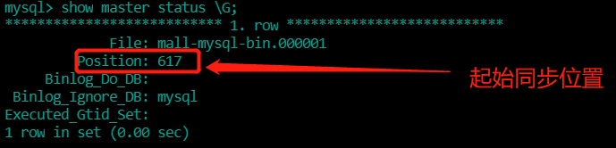

##### 1、新建主服务器实例3308

```sh
docker run -p 3308:3306 --name mysql-master \
-v /data/docker/mysql-master/log:/var/log/mysql \
-v /data/docker/mysql-master/data:/var/lib/mysql \
-v /data/docker/mysql-master/conf:/etc/mysql \
-e MYSQL_ROOT_PASSWORD=root  \
-d mysql:5.7
```

#### 2、进入/data/docker/mysql-master/conf目录下新建my.cnf

```sh
vim my.cnf

# 主服节点配置
[client]
default_character_set=utf8
[mysqld]
collation_server = utf8_general_ci
character_set_server = utf8
# 设置server_id，同一局域网中需要唯一
server_id=101 
# 指定不需要同步的数据库名称
binlog-ignore-db=mysql  
# 开启二进制日志功能
log-bin=mall-mysql-bin  
# 设置二进制日志使用内存大小（事务）
binlog_cache_size=1M  
# 设置使用的二进制日志格式（mixed,statement,row）
binlog_format=mixed  
# 二进制日志过期清理时间。默认值为0，表示不自动清理。
expire_logs_days=7  
# 跳过主从复制中遇到的所有错误或指定类型的错误，避免slave端复制中断。
# 如：1062错误是指一些主键重复，1032错误是因为主从数据库数据不一致
slave_skip_errors=1062
```

#### 3、修改完配置后重启master实例

```sh
docker restart mysql-master
```

#### 4、进入mysql-master容器

```sh
docker exec -it mysql-master /bin/bash
# 登录mysql
mysql -uroot -proot
```

#### 5、master容器实例内创建数据同步用户

```sh
CREATE USER 'slave'@'%' IDENTIFIED BY '123456';
GRANT REPLICATION SLAVE,REPLICATION CLIENT ON *.* TO 'slave'@'%';
```

#### 6、新建从服务器

```sh
docker run -p 3309:3306 --name mysql-slave \
-v /data/docker/mysql-slave/log:/var/log/mysql \
-v /data/docker/mysql-slave/data:/var/lib/mysql \
-v /data/docker/mysql-slave/conf:/etc/mysql \
-e MYSQL_ROOT_PASSWORD=root  \
-d mysql:5.7
```

#### 7、进入/data/docker/mysql-slave/conf目录下新建my.cnf

```sh
vim my.cnf

# 从节点配置
[client]
default_character_set=utf8
[mysqld]
collation_server = utf8_general_ci
character_set_server = utf8
# 设置server_id，同一局域网中需要唯一
server_id=102
# 指定不需要同步的数据库名称
binlog-ignore-db=mysql  
# 开启二进制日志功能，以备Slave作为其它数据库实例的Master时使用
log-bin=mall-mysql-slave1-bin  
# 设置二进制日志使用内存大小（事务）
binlog_cache_size=1M  
# 设置使用的二进制日志格式（mixed,statement,row）
binlog_format=mixed  
# 二进制日志过期清理时间。默认值为0，表示不自动清理。
expire_logs_days=7  
# 跳过主从复制中遇到的所有错误或指定类型的错误，避免slave端复制中断。
# 如：1062错误是指一些主键重复，1032错误是因为主从数据库数据不一致
slave_skip_errors=1062  
# relay_log配置中继日志
relay_log=mall-mysql-relay-bin  
# log_slave_updates表示slave将复制事件写进自己的二进制日志
log_slave_updates=1  
# slave设置为只读（具有super权限的用户除外）
read_only=1
```

#### 8、修改完配置后重启slave实例

```sh
docker restart mysql-slave
```

#### 9、在主数据库中查看主从同步状态

```
docker exec -it mysql-master /bin/bash
mysql -uroot -proot

# 查看主数据库状态以及从哪里开始同步
show master status \G;
```



<br/>

#### 10、进入mysql-slave容器

```sh
docker exec -it mysql-slave /bin/bash
mysql -uroot -proot
```

#### 11、在从数据库中配置主从复制

```sh
# 主从复制配置语句
change master to master_host='宿主机ip', master_user='slave', master_password='123456', master_port=3308, master_log_file='mall-mysql-bin.000001', master_log_pos=617, master_connect_retry=30;
```

主从复制参数说明：

master_host：主数据库的IP地址；

master_port：主数据库的运行端口；

master_user：在主数据库创建的用于同步数据的用户账号；

master_password：在主数据库创建的用于同步数据的用户密码；

master_log_file：指定从数据库要复制数据的日志文件，通过查看主数据的状态，获取File参数；

master_log_pos：指定从数据库从哪个位置开始复制数据，通过查看主数据的状态，获取Position参数；

master_connect_retry：连接失败重试的时间间隔，单位为秒。

#### 12、在从数据库中查看主从同步状态

```sh
show slave status \G;
```


#### 13、在从数据库中开始主从同步

```sh
start slave;
```


<br/>

#### 14、查看从数据库状态发现已经同步


#### 15、主从复制测试

主机新建库-使用库-新建表-插入数据，ok

从机使用库-查看记录，ok
