cluster(集群)模式-docker版哈希槽分区进行亿级数据存储

- 面试题：

	   1~2亿条数据需要缓存，请问如何设计这个存储案例

- 回答：

		单机单台100%不可能，肯定是分布式存储，用redis如何落地？

上述问题阿里P6~P7工程案例和场景设计类必考题目，一般业界有3中解决方案

**1、哈希取余分区**

- 原理：2亿条记录就是2亿个k,v，我们单机不行必须要分布式多机，假设有3台机器构成一个集群，用户每次读写操作都是根据公式：hash(key) % N个机器台数，计算出哈希值，用来决定数据映射到哪一个节点上
- 优点：
  简单粗暴，直接有效，只需要预估好数据规划好节点，例如3台、8台、10台，就能保证一段时间的数据支撑。使用Hash算法让固定的一部分请求落到同一台服务器上，这样每台服务器固定处理一部分请求（并维护这些请求的信息），起到负载均衡+分而治之的作用。
- 缺点：
   原来规划好的节点，进行扩容或者缩容就比较麻烦了额，不管扩缩，每次数据变动导致节点有变动，映射关系需要重新进行计算，在服务器个数固定不变时没有问题，如果需要弹性扩容或故障停机的情况下，原来的取模公式就会发生变化：Hash(key)/3会变成Hash(key) /?。此时地址经过取余运算的结果将发生很大变化，根据公式获取的服务器也会变得不可控。某个redis机器宕机了，由于台数数量变化，会导致hash取余全部数据重新洗牌。

**2、一直性哈希算法分区**

- 能干嘛？ 
  
  提出一致性Hash解决方案。目的是当服务器个数发生变动时尽量减少影响客户端到服务器的映射关系
- 3大步骤：
  
  算法构建一致性哈希环：
*致性哈希算法必然有个hash函数并按照算法产生hash值，这个算法的所有可能哈希值会构成一个全量集，这个集合可以成为一个hash空间[0,2^32-1]，这个是一个线性空间，但是在算法中，我们通过适当的逻辑控制将它首尾相连(0 = 2^32),这样让它逻辑上形成了一个环形空间。*
  
  服务器IP节点映射
  
  *将集群中各个IP节点或者主机名作为关键字进行哈希映射到环上的某一个位置。*
  
  key落到服务器规则：
  
  *当我们需要存储一个kv键值对时，首先计算key的hash值，hash(key)，将这个key使用相同的函数Hash计算出哈希值并确定此数据在环上的位置，从此位置沿环顺时针“行走”，第一台遇到的服务器就是其应该定位到的服务器，并将该键值对存储在该节点上。*
- 优点：
  
  容错性：
*假设Node C宕机，可以看到此时对象A、B、D不会受到影响，只有C对象被重定位到Node D。一般的，在一致性Hash算法中，如果一台服务器不可用，则受影响的数据仅仅是此服务器到其环空间中前一台服务器（即沿着逆时针方向行走遇到的第一台服务器）之间数据，其它不会受到影响。简单说，就是C挂了，受到影响的只是B、C之间的数据，并且这些数据会转移到D进行存储。*
  
  容错性：
  
  *数据量增加了，需要增加一台节点NodeX，X的位置在A和B之间，那收到影响的也就是A到X之间的数据，重新把A到X的数据录入到X上即可，不会导致hash取余全部数据重新洗牌。*

- 缺点：
  
  Hash环的数据倾斜问题	
  
  一致性Hash算法在服务节点太少时，容易因为节点分布不均匀而造成数据倾斜（被缓存的对象大部分集中缓存在某一台服务器上）问题，
  
  例如系统中只有两台服务器：一台服务器宕机后会有大量数据打到一台服务器上.

**3、哈希槽分区**

- 是什么？
  
  为什么出现？
  
  *解决一致性哈希算法的数据倾斜问题*
  
  *哈希槽的实质就是一个数组，数组[0,2^14-1]形成hash slot空间*
  
  能干什么？
  
  *解决均匀分配的问题，在数据和节点之间又加入了一层，把这层称为哈希槽（slot），用于管理数据和节点之间的关系，现在就相当于节点上放的是槽，槽里放的是数据。*
  
  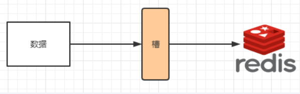
  
  *槽解决的是粒度问题，相当于把粒度变大了，这样便于数据移动。哈希解决的是映射问题，使用key的哈希值来计算所在的槽，便于数据分配。*
  
  多少个hash槽
  
  *一个集群只能有16384个槽，编号0-16383（0-2^14-1）。这些槽会分配给集群中的所有主节点，分配策略没有要求。可以指定哪些编号的槽分配给哪个主节点。集群会记录节点和槽的对应关系。解决了节点和槽的关系后，接下来就需要对key求哈希值，然后对16384取余，余数是几key就落入对应的槽里。slot = CRC16(key) % 16384。以槽为单位移动数据，因为槽的数目是固定的，处理起来比较容易，这样数据移动问题就解决了。*
- 哈希槽计算
  
  *Redis 集群中内置了 16384 个哈希槽，redis 会根据节点数量大致均等的将哈希槽映射到不同的节点。当需要在 Redis 集群中放置一个 key-value时，redis 先对 key 使用 crc16 算法算出一个结果，然后把结果对 16384 求余数，这样每个 key 都会对应一个编号在 0-16383 之间的哈希槽，也就是映射到某个节点上。如下代码，key之A 、B在Node2， key之C落在Node3上*
  
  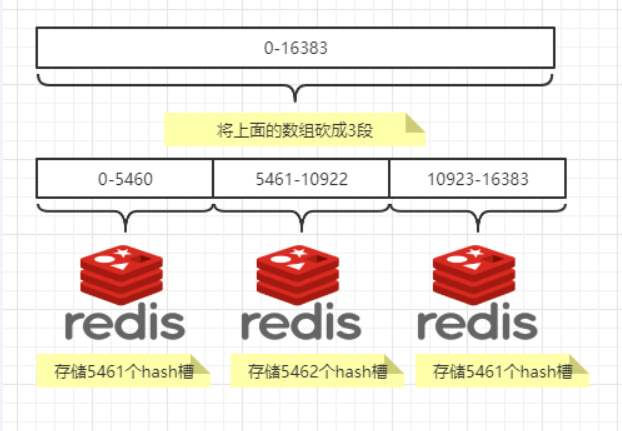
  
  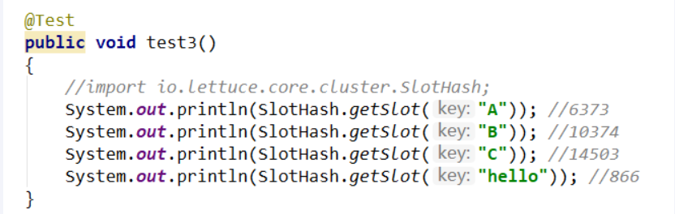

## 1、3主3从redis集群配置

#### 关闭防火墙+启动docker后台服务

```sh
systemctl start docker
```

#### 新建6个docker容器redis实例

创建需要映射的目录：

```sh
mkdir -p /data/docker/redis-cluster/redis-node-1/data /data/docker/redis-cluster/redis-node-1/conf
mkdir -p /data/docker/redis-cluster/redis-node-2/data /data/docker/redis-cluster/redis-node-2/conf
mkdir -p /data/docker/redis-cluster/redis-node-3/data /data/docker/redis-cluster/redis-node-3/conf
mkdir -p /data/docker/redis-cluster/redis-node-4/data /data/docker/redis-cluster/redis-node-4/conf
mkdir -p /data/docker/redis-cluster/redis-node-5/data /data/docker/redis-cluster/redis-node-5/conf
mkdir -p /data/docker/redis-cluster/redis-node-6/data /data/docker/redis-cluster/redis-node-6/conf
```

端口规划：6381~6386

```sh
docker run -d --name redis-node-1 --net host --privileged=true -v /data/docker/redis-cluster/redis-node-1:/data redis:7.0.11 --cluster-enabled yes --appendonly yes --port 6381
docker run -d --name redis-node-2 --net host --privileged=true -v /data/docker/redis-cluster/redis-node-2:/data redis:7.0.11 --cluster-enabled yes --appendonly yes --port 6382
docker run -d --name redis-node-3 --net host --privileged=true -v /data/docker/redis-cluster/redis-node-3:/data redis:7.0.11 --cluster-enabled yes --appendonly yes --port 6383
docker run -d --name redis-node-4 --net host --privileged=true -v /data/docker/redis-cluster/redis-node-4:/data redis:7.0.11 --cluster-enabled yes --appendonly yes --port 6384
docker run -d --name redis-node-5 --net host --privileged=true -v /data/docker/redis-cluster/redis-node-5:/data redis:7.0.11 --cluster-enabled yes --appendonly yes --port 6385
docker run -d --name redis-node-6 --net host --privileged=true -v /data/docker/redis-cluster/redis-node-6:/data redis:7.0.11 --cluster-enabled yes --appendonly yes --port 6386
```

命令分步解释：

docker run：创建并运行docker容器实例

--name redis-node-1:容器名字

--net host:使用主机的IP和端口，默认

--privileged=true:获取宿主机root用户权限

-v /data/docker/redis-cluster/redis-node-6:/data：容器卷，宿主机地址：docker内部地址

reids:7.0.11:redis镜像和版本号

--cluster-enabled yes:开启redis集群

--appendonly yes：开启持久化

--port 6386:redis端口号

查看reids是否启动

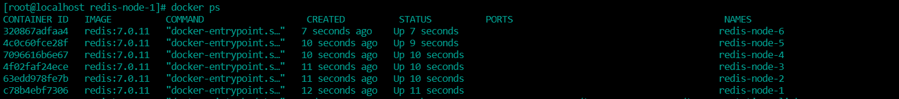

#### 进入容器redis-node-1并为6台机器构建集群关系

进入容器

```sh
docker exec -it redis-node-1 /bin/bash
```

构建组从关系(容器内执行)

```sh
redis-cli --cluster create 192.168.0.102:6381 192.168.0.102:6382 192.168.0.102:6383 192.168.0.102:6384 192.168.0.102:6385 192.168.0.102:6386 --cluster-replicas 1
```

--cluster-replicas 1 表示为每个master创建一个slave节点

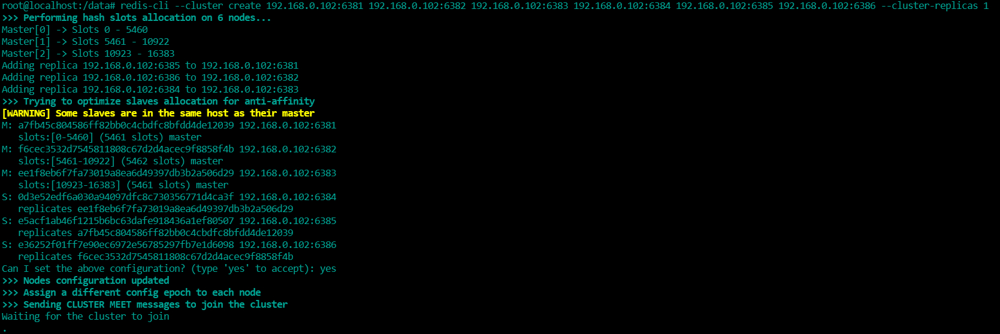

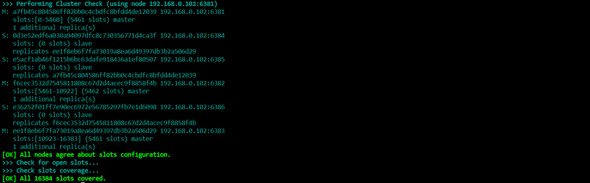

如上图显示3主3从构建成功

#### 链接进入6381作为切入点，查看集群状态

```sh
# 查看集群信息
cluster info
# 查看集群节点信息
cluster nodes
```

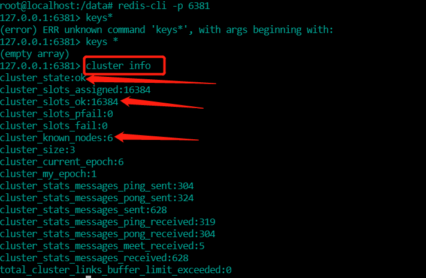

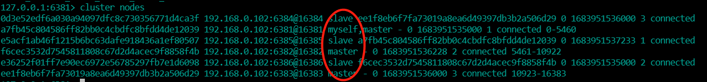

## 2、主从容错切换迁移案例

#### 数据读写存储

- 启动6机构成的集群

- 对6381新增两个key

- 防止路由失效加参数-c并新增两个key

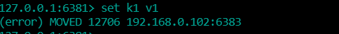

```sh
redis-cli -p 6381 -c
```

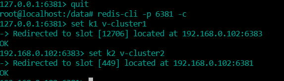

- 查看集群信息
  
  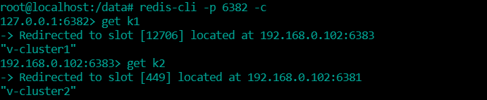
  ```sh
  redis-cli --cluster check 192.168.0.102:6381
  ```

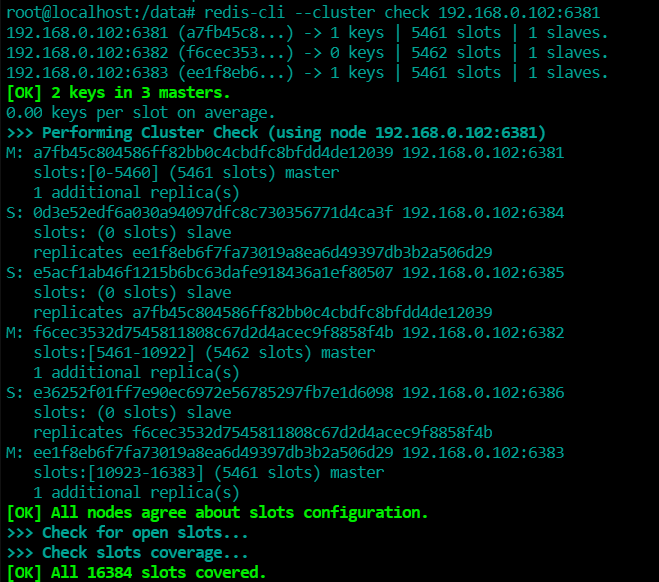

#### 容错切换迁移

- 主6381和从机切换，先停止主机6381

		6381主机停了，对应的真实从机上位

		6381作为1号主机分配的从机以实际情况为准	，具体是几号机器就是几号

- 再次查看集群信息
  ```
  docker exec -it redis-node-2 /bin/bash
  redis-cli -p 6382 -c
  cluster nodes
  ```
  
  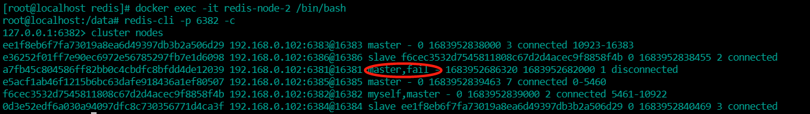
  
  可以看到原来6381节点的从节点6385已经变成了主节点
- 还原之前的3主3从
  
  先启动6381(此时6381节点还是从节点，并不会自动变为主节点)
  ```sh
  docker start redis-node-1
  ```
  
  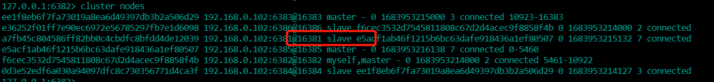
  
  再停6385(让系统自动主从切换)
  ```sh
  docker stop redis-node-5
  ```
  
  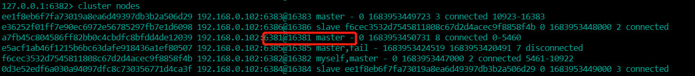可以看到6381又变成了主节点
  
  再启6385
  ```sh
  docker start redis-node-5
  ```
  
  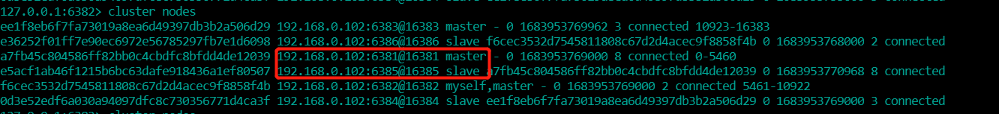
  
  集群恢复正常
- 查看集群状态
  ```sh
  docker exec -it redis-node-2 /bin/bash
  redis-cli --cluster check 192.168.0.102:6381
  ```

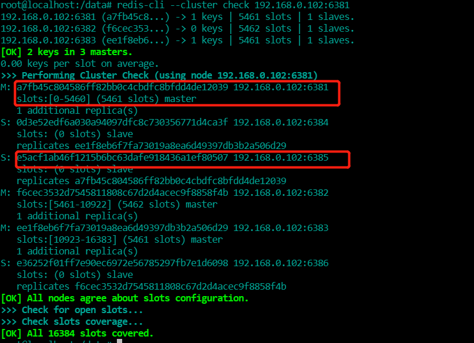

## 3、主从扩容案例

#### 新建6387、6388两个节点+新建启动+查看是否8节点

```sh
mkdir -p /data/docker/redis-cluster/redis-node-7/data /data/docker/redis-cluster/redis-node-7/conf
mkdir -p /data/docker/redis-cluster/redis-node-8/data /data/docker/redis-cluster/redis-node-8/conf

docker run -d --name redis-node-7 --net host --privileged=true -v /data/docker/redis-cluster/redis-node-7:/data redis:7.0.11 --cluster-enabled yes --appendonly yes --port 6387
docker run -d --name redis-node-8 --net host --privileged=true -v /data/docker/redis-cluster/redis-node-8:/data redis:7.0.11 --cluster-enabled yes --appendonly yes --port 6388

docker ps
```

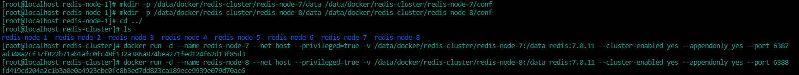

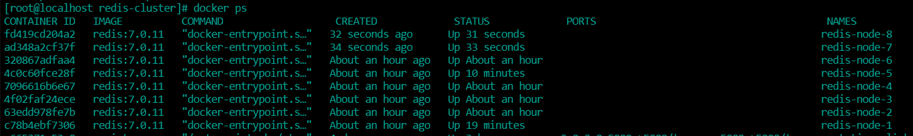

#### 进入6378容器实例内部

```sh
docker exec -it redis-node-7 /bin/bash
```

#### 将新增的6387节点(空槽号)作为master节点加入原集群

```sh
redis-cli --cluster add-node 192.168.0.102:6387 192.168.0.102:6381
```

将新增的6387作为master节点加入集群
redis-cli --cluster add-node 自己实际IP地址:6387 自己实际IP地址:6381
6387 就是将要作为master新增节点
6381 就是原来集群节点里面的领路人，相当于6387拜拜6381的码头从而找到组织加入集群

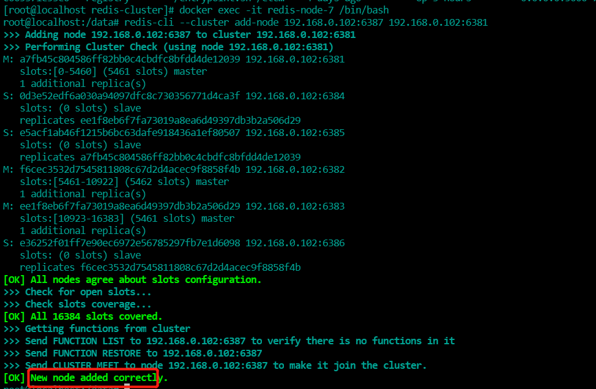

#### 检查集群情况第1次

```sh
redis-cli --cluster check 192.168.0.102:6381
```

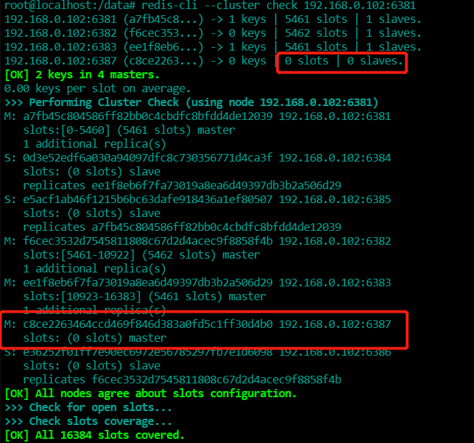

#### 重新分配槽号

```sh
redis-cli --cluster reshard 192.168.0.102:6381
```

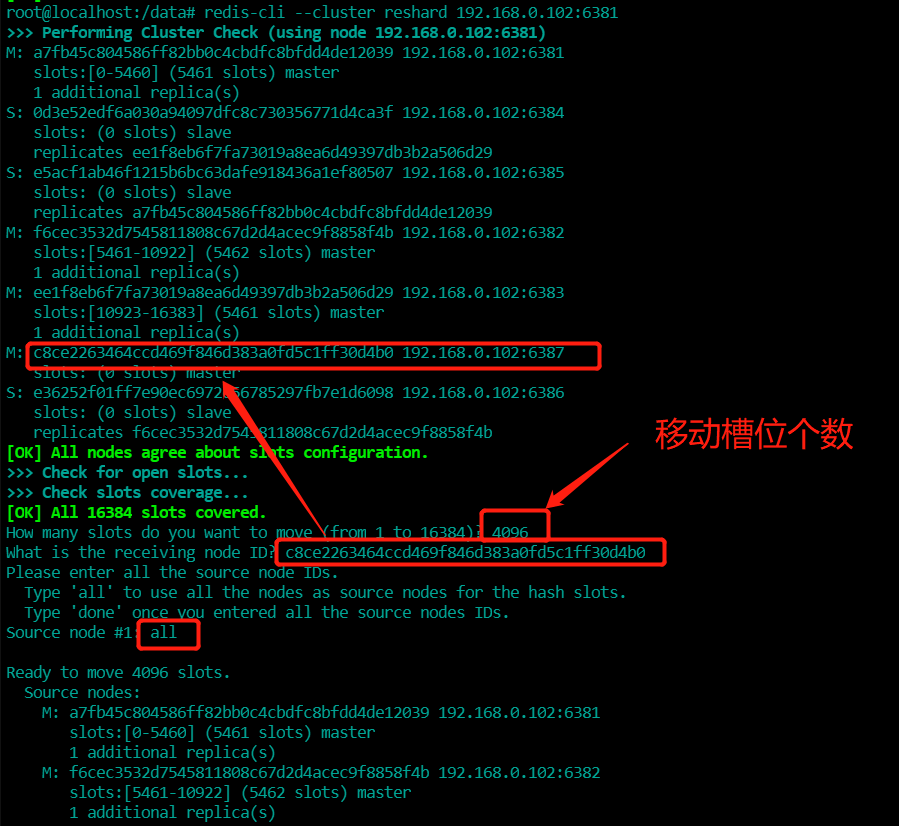

为了确保槽位的平均，移动槽位数计算公式：16384/master台数

#### 检查集群情况第2次

```sh
redis-cli --cluster check 192.168.0.102:6381
```

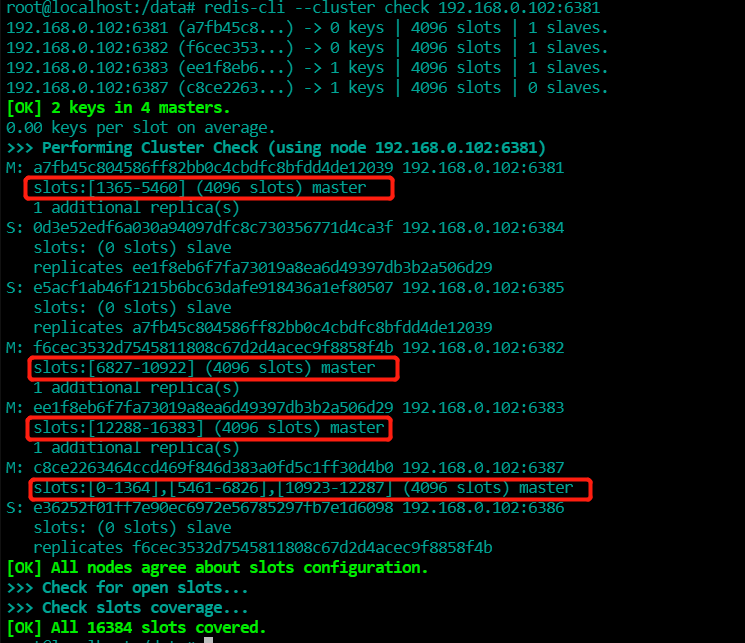

可见6387上的4096个槽位是从其他三个master节点移动的

为什么6387是3个新的区间，以前的还是连续？
重新分配成本太高，所以前3家各自匀出来一部分，从6381/6382/6383三个旧节点分别匀出1364个坑位给新节点6387

#### 为主节点6387分配从节点6388

```sh

命令：redis-cli --cluster add-node ip:新slave端口 ip:新master端口 --cluster-slave --cluster-master-id 新主机节点ID

redis-cli --cluster add-node 192.168.0.102:6388 192.168.0.102:6387 --cluster-slave --cluster-master-id c8ce2263464ccd469f846d383a0fd5c1ff30d4b0-------这个是6387的编号，按照自己实际情况
```

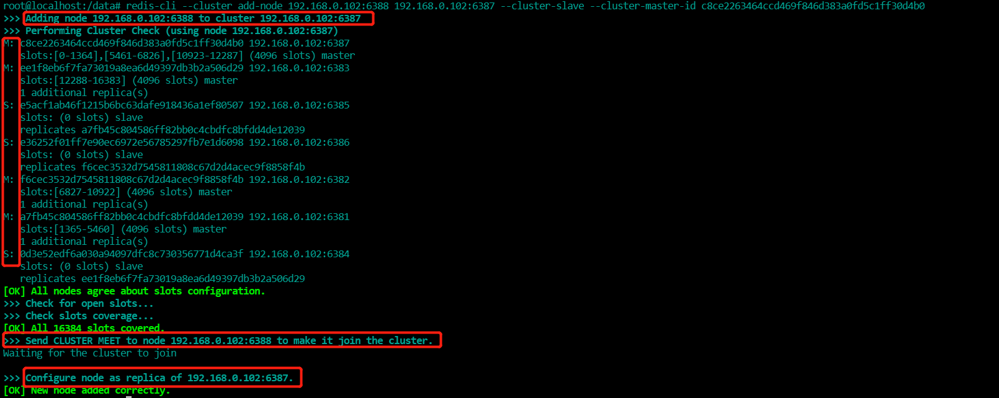

#### 检查集群情况第3次

```sh
redis-cli --cluster check 192.168.0.102:6381
```

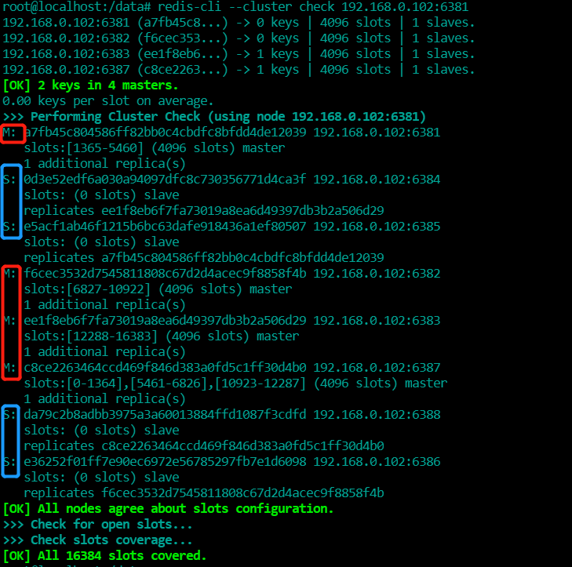

集群扩容完成

## 4、主从缩容案例

#### 目的:下线6387和6388

#### 检查集群情况1获得6388节点ID

```sh
redis-cli --cluster check 192.168.0.102:6381
```

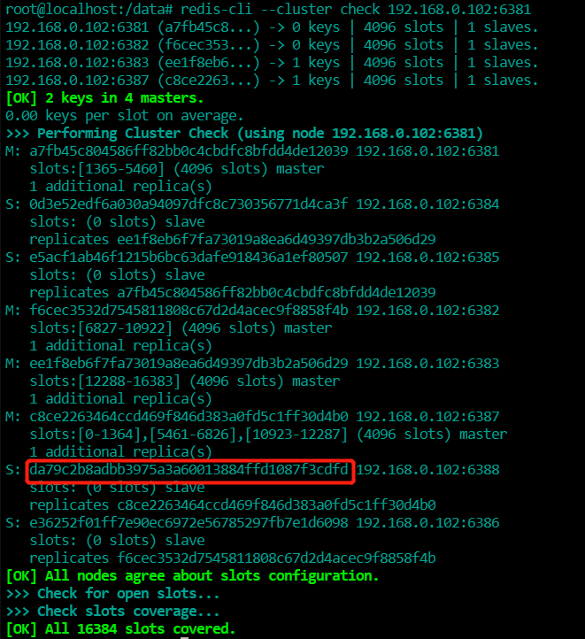

#### 从集群中将从节点6388删除

```sh
命令：redis-cli --cluster del-node ip:从机端口 从机6388节点ID
redis-cli --cluster del-node 192.168.0.102:6388 da79c2b8adbb3975a3a60013884ffd1087f3cdfd
```


```sh
# 检查一下集群情况
redis-cli --cluster check 192.168.0.102:6388
```

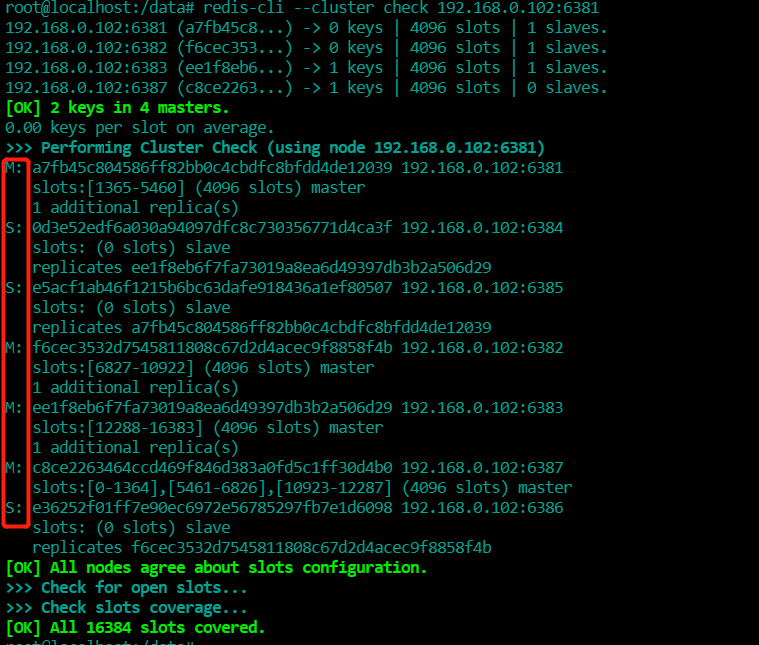

#### 将6387的槽号清空，重新分配，本例将清出来的槽号都给6381

```sh
redis-cli --cluster reshard 192.168.0.102:6381
```

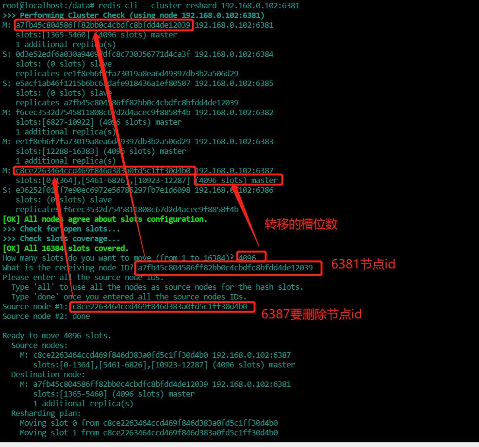

#### 检查集群情况第2次

```sh
redis-cli --cluster check 192.168.0.102:6381
```

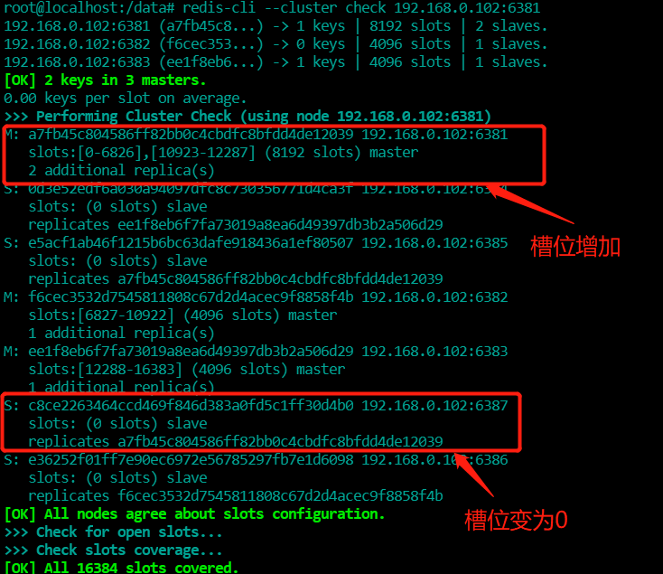

6387节点槽位转移空后，立刻从主节点变成了从节点

#### 集群删除6387节点

```sh
命令：redis-cli --cluster del-node ip:端口 6387节点ID
redis-cli --cluster del-node 192.168.0.102:6387 c8ce2263464ccd469f846d383a0fd5c1ff30d4b0
```

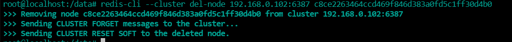

#### 检查集群情况第3次

```sh
redis-cli --cluster check 192.168.0.102:6381
```

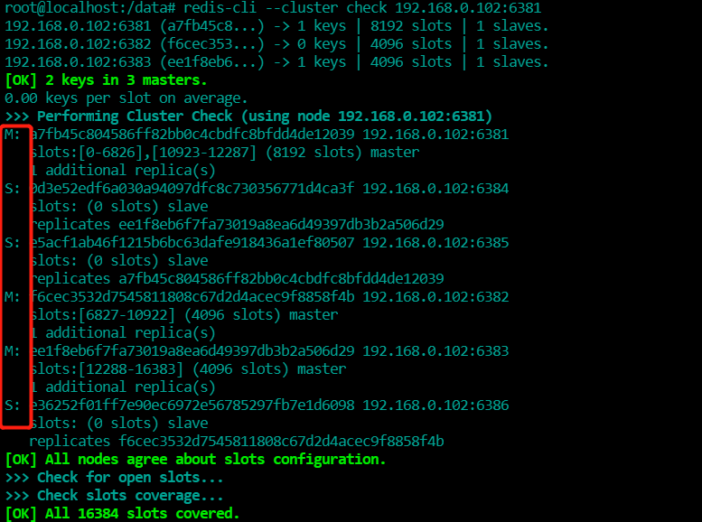

集群恢复3主3从

## 5、集群关闭、启动

docker集群

```sh
# 集群关闭
docker stop redis-node-1 redis-node-2 redis-node-3 redis-node-4 redis-node-5 redis-node-6

# 集群启动
docker start redis-node-1 redis-node-2 redis-node-3 redis-node-4 redis-node-5 redis-node-6
```

Liunxs

```sh
# 查看redis集群进程
ps -ef|grep redis
# kill 停止集群 在一台机器上时，如果是多个机器，一个一个进行停机即可
kill -9 进程id多个

# 重启集群，一个一个服务启动即可(进入redis/bin)
./redis-server /data/redis-cluster/redis01/redis.conf 
./redis-server /data/redis-cluster/redis02/redis.conf 
./redis-server /data/redis-cluster/redis03/redis.conf 
./redis-server /data/redis-cluster/redis04/redis.conf 
./redis-server /data/redis-cluster/redis05/redis.conf 
./redis-server /data/redis-cluster/redis06/redis.conf 
```