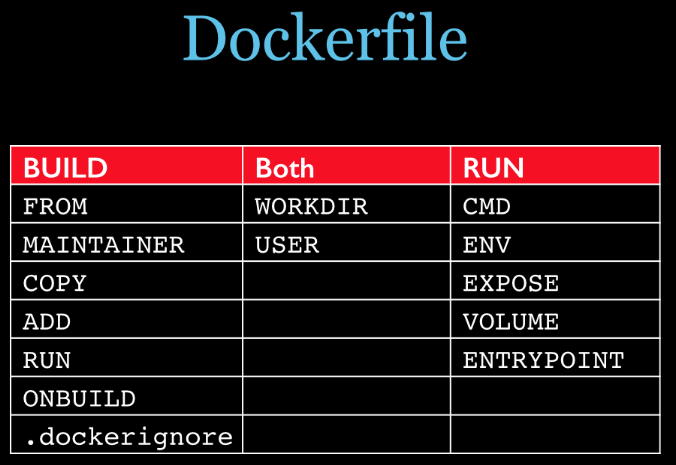
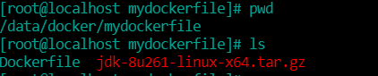

## 是什么

Dockerfile是用来构建Docker镜像的文本文件，是由一条条构建镜像所需的指令和参数构成的脚本

#### 1、概述


#### 2、官网

https://docs.docker.com/engine/referencs/builder/

#### 3、构建三步骤

- 编写Dockerfile文件
- docker build命令构建镜像
- docker run依镜像运行容器实例

## DockerFile构建过程解析

#### Dockerfile内容基础知识

1. 每条保留字指令都必须为大写字母且后面要跟随至少一个参数
2. 指令按照从上到下，顺序执行
3. #表示注释
4. 每条指令都会创建一个新的镜像并对镜像进行提交

#### Docker执行Dockerfile的大致流程

1. docker从基础镜像运行一个容器
2. 执行一条指令并对容器做出修改
3. 执行类似docker commit的操作提交一个新的镜像层
4. docker再基于刚提交的镜像运行一个新容器
5. 执行dokcerfile中的下一条指令直到所有指令都执行完成

#### 小总结

从应用软件的角度来看，Dockerfile、Docker镜像与Docker容器分别代表软件的三个不同阶段，

- Dockerfile是软件的原材料
- Docker镜像是软件的交付品
- Docker容器则可以认为是软件镜像的运行态，也即依照镜像运行的容器实例

Dockerfile面向开发，Docker镜像成为交付标准，Docker容器则涉及部署与运维，三者缺一不可，合力充当Docker体系的基石。


1 Dockerfile，需要定义一个Dockerfile，Dockerfile定义了进程需要的一切东西。Dockerfile涉及的内容包括执行代码或者是文件、环境变量、依赖包、运行时环境、动态链接库、操作系统的发行版、服务进程和内核进程(当应用进程需要和系统服务和内核进程打交道，这时需要考虑如何设计namespace的权限控制)等等;

2 Docker镜像，在用Dockerfile定义一个文件之后，docker build时会产生一个Docker镜像，当运行 Docker镜像时会真正开始提供服务;

3 Docker容器，容器是直接提供服务的。

## DockerFile常用保留字指令

#### 参考tomcat8的dockerfile入门

https://github.com/docker-library/tomcat

1. FROM:基础镜像，当前新镜像是基于哪个镜像的，指定一个已经存在的镜像作为模板，第一条必须是FROM
2. MAINTAINER:镜像维护者的姓名和邮箱
3. RUN：容器构建时需要运行的命令，RUN是在docker build时运行
   
   两种格式
   
   shell格式：RUN yum -y install vim
   
   exec格式：
   ```sh
   RUN ["可执行文件","参数1","参数2"]
   例如
   RUN ["./test.php","dev","offline"] 等价于./test.php dev offline
   ```
4. EXPOSE:当前容器对外暴漏的端口
5. WORKDIR：指定在创建容器后，终端默认登录的进来工作目录，一个落脚点
6. USER：指定该镜像以什么样的用户去执行，如果都不指定，默认是root
7. ENV：用来在构建镜像过程中设置环境变量
8. ADD：将宿主机目录下的文件拷贝进镜像且会自动处理URL和解压tar压缩包
9. COPY：类似ADD，拷贝文件和目录到镜像中，将从构建上下文目录中<源路径>的文件/目录复制到新的一层的镜像内的<目标位置>
   ```sh
   COPY src dest
   COPY ["src","dest"]
   ```
10. VOLUME:容器数据卷，用于数据保存和持久化工作
11. CMD：指定容器启动后的要干的事情
    
    
    
    注意：
    
    Dockerfile中可以有多个CMD指令，但只有最后一个生效，CMD会被docker run之后的参数替换
    
    参考官网Tomcat的dockerfile演示讲解
    
    官网最后一行命令：
    
    
    
    我们演示自己的覆盖操作：
    ```
    # /bin/bash 便是覆盖了CMD命令
    docker run -it -p 8080:8080 85c5fa318935 /bin/bash
    ```
    
    它和前面RUN命令的区别
    
    CMD是在docker run时执行
    
    RUN是在docker build时执行
12. ENTRYPOINT:也是用来指定一个容器启动时要执行的命令
    
       类似于CMD指令，但是ENTRYPOINT不会被docker run后面的命令覆盖，而且这些命令行参数会被当做参数送给ENTRYPOINT指令指定的程序
    
       命令格式和案例说明：
    
       
    
       ENTRYPOINT可以和CMD一起用，一般是变参才会使用 CMD ，这里的 CMD 等于是在给 ENTRYPOINT 传参。
    
       当指定了ENTRYPOINT后，CMD的含义就发生了变化，不再是直接运行其命令而是将CMD的内容作为参数传递给ENTRYPOINT指令，他两个组合会变成<ENTRYPOINT>"<CMD>"
    
       案例如下：假如已通过Dockerfile构建了nginx:test镜像
    ```
    FROM nginx
    
    ENTRYPOINT ["nginx","-c"] #定参
    CMD ["/etc/nginx/nginx.conf"] # 变参
    ```
    
    
    
    优点：在执行docker run的时候可以指定ENTRYPOINT运行时所需的参数
    
    主要：如果Dokcerfile中存在多个ENTRYPOINT指令，仅最后一个生效
13. 小总结
    
    
    
    <br/>

## 案例

1. 自定义镜像mycentosjava8
   
   **要求：**centos7镜像具备vim+ifconfig+jdk8
   
   JDK的下载镜像地址：官网下载地址：
   
   https://www.oracle.com/java/technologies/downloads/#java8
   
   
   
   **编写**
   
   准备编写Dockerfile文件,下载jdk-8u261-linux-x64.tar.gz和Dockerfile放在同一目录中
   ```sh
   FROM centos
   MAINTAINER amazecode<amazecode@163.com>
    
   ENV MYPATH /usr/local
   WORKDIR $MYPATH
   
   # 解决yum 安装工具失败问题 
   RUN cd /etc/yum.repos.d/
   RUN sed -i 's/mirrorlist/#mirrorlist/g' /etc/yum.repos.d/CentOS-*
   RUN sed -i 's|#baseurl=http://mirror.centos.org|baseurl=http://vault.centos.org|g' /etc/yum.repos.d/CentOS-*
   RUN yum makecache
   RUN yum update -y
   
   
   #安装vim编辑器
   RUN yum -y install vim
   #安装ifconfig命令查看网络IP
   RUN yum -y install net-tools
   #安装java8及lib库
   RUN yum -y install glibc.i686
   RUN mkdir /usr/local/java
   #ADD 是相对路径jar,把jdk-8u261-linux-x64.tar.gz添加到容器中,安装包必须要和Dockerfile文件在同一位置
   ADD jdk-8u261-linux-x64.tar.gz /usr/local/java/
   #配置java环境变量
   ENV JAVA_HOME /usr/local/java/jdk1.8.0_261
   ENV JRE_HOME $JAVA_HOME/jre
   ENV CLASSPATH $JAVA_HOME/lib/dt.jar:$JAVA_HOME/lib/tools.jar:$JRE_HOME/lib:$CLASSPATH
   ENV PATH $JAVA_HOME/bin:$PATH
    
   EXPOSE 80
    
   CMD echo $MYPATH
   CMD echo "success--------------ok"
   CMD /bin/bash
   ```
   
   
   
   **构建**
   ```sh
   # 命令格式
   docker build -t 新景象名字:TAG .
   # 实际构建命令
   docker build -t centosjava8:1.5 .
   ```
   
   
   
   
   
   **运行**
   ```sh
   # 运行容器
   docker run -it centosjava8:1.5 /bin/bash
   
   # 查看jdk版本 
   java -version
   
   # 查看ifconfig是否安装成功
   ifconfig
   ```
   
   
   
   **再体会下UnionFS**
   
   UnionFS（联合文件系统）：Union文件系统（UnionFS）是一种分层、轻量级并且高性能的文件系统，它支持对文件系统的修改作为一次提交来一层层的叠加，同时可以将不同目录挂载到同一个虚拟文件系统下(unite several directories into a single virtual filesystem)。Union 文件系统是 Docker 镜像的基础。镜像可以通过分层来进行继承，基于基础镜像（没有父镜像），可以制作各种具体的应用镜像。
   
   
   
   特性：一次同时加载多个文件系统，但从外面看起来，只能看到一个文件系统，联合加载会把各层文件系统叠加起来，这样最终的文件系统会包含所有底层的文件和目录
2. 虚悬镜像
   
   **是什么？**
   
   仓库名、标签都是<none>的镜像，俗称dangling image
   
   Dockerfile写一个
   ```sh
   FROM ubuntu
   CMD echo 'action is success'
   ```
   
   **查看虚悬镜像**
   ```
   docker build .
   ```
   
   
   
   
   
   **删除虚悬镜像**
   ```sh
   # 删除所有的虚悬镜像
   docker image prune
   ```
   
   
   
   <br/>
3. 作业自定义镜像myubuntu
   
   **编写**
   
   准备编写Dockerfile文件
   ```sh
   FROM ubuntu
   MAINTAINER amazecode<amazecode@126.com>
    
   ENV MYPATH /usr/local
   WORKDIR $MYPATH
    
   RUN apt-get update
   RUN apt-get install net-tools
   #RUN apt-get install -y iproute2
   #RUN apt-get install -y inetutils-ping
    
   EXPOSE 80
    
   CMD echo $MYPATH
   CMD echo "install inconfig cmd into ubuntu success--------------ok"
   CMD /bin/bash
   ```
   
   **构建**
   ```sh
   # 编译Dockerfile文件构建镜像
   docker build -t ubuntu-ifconfig:1.1 .
   ```
   
   **运行**
   ```sh
   # 运行新容器，并验证
   docker run -it ubuntu-ifconfig:1.1 /bin/bash
   
   # 验证ifconfig是否安装成功
   ifconfig
   ```
   
   

## 小总结


