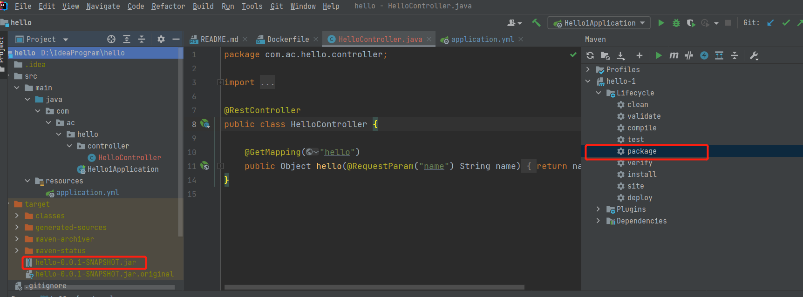
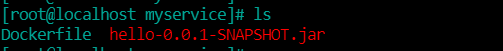
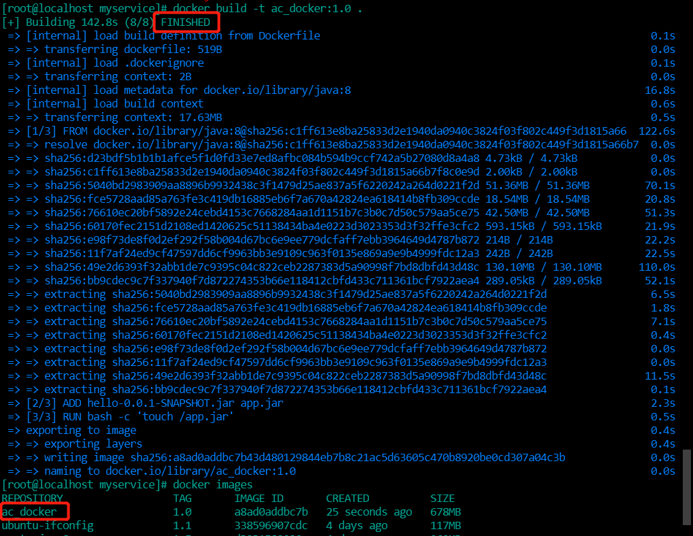
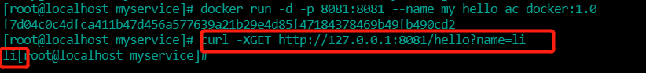
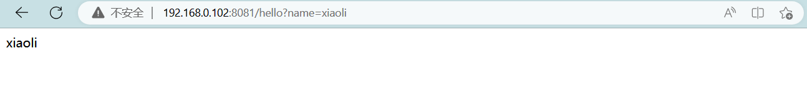

## 通过IDEA新建一个普通微服务项目

1. 建Module
2. 改POM
   ```xml
   <?xml version="1.0" encoding="UTF-8"?>
   <project xmlns="http://maven.apache.org/POM/4.0.0" xmlns:xsi="http://www.w3.org/2001/XMLSchema-instance"
            xsi:schemaLocation="http://maven.apache.org/POM/4.0.0 https://maven.apache.org/xsd/maven-4.0.0.xsd">
       <modelVersion>4.0.0</modelVersion>
       <parent>
           <groupId>org.springframework.boot</groupId>
           <artifactId>spring-boot-starter-parent</artifactId>
           <version>2.5.6</version>
           <relativePath/>
       </parent>
   
       <groupId>com.atguigu.docker</groupId>
       <artifactId>docker_boot</artifactId>
       <version>0.0.1-SNAPSHOT</version>
   
       <properties>
           <project.build.sourceEncoding>UTF-8</project.build.sourceEncoding>
           <maven.compiler.source>1.8</maven.compiler.source>
           <maven.compiler.target>1.8</maven.compiler.target>
           <junit.version>4.12</junit.version>
           <log4j.version>1.2.17</log4j.version>
           <lombok.version>1.16.18</lombok.version>
           <mysql.version>5.1.47</mysql.version>
           <druid.version>1.1.16</druid.version>
           <mapper.version>4.1.5</mapper.version>
           <mybatis.spring.boot.version>1.3.0</mybatis.spring.boot.version>
       </properties>
   
       <dependencies>
           <!--SpringBoot通用依赖模块-->
           <dependency>
               <groupId>org.springframework.boot</groupId>
               <artifactId>spring-boot-starter-web</artifactId>
           </dependency>
           <dependency>
               <groupId>org.springframework.boot</groupId>
               <artifactId>spring-boot-starter-actuator</artifactId>
           </dependency>
           <!--test-->
           <dependency>
               <groupId>org.springframework.boot</groupId>
               <artifactId>spring-boot-starter-test</artifactId>
               <scope>test</scope>
           </dependency>
       </dependencies>
   
       <build>
           <plugins>
               <plugin>
                   <groupId>org.springframework.boot</groupId>
                   <artifactId>spring-boot-maven-plugin</artifactId>
               </plugin>
               <plugin>
                   <groupId>org.apache.maven.plugins</groupId>
                   <artifactId>maven-resources-plugin</artifactId>
                   <version>3.1.0</version>
               </plugin>
           </plugins>
       </build>
   
   </project>
   ```
3. 写YML
   ```yaml
   server.port=8081
   ```
4. 主启动
   ```java
   @SpringBootApplication
   public class DockerBootApplication
   {
       public static void main(String[] args)
       {
           SpringApplication.run(DockerBootApplication.class, args);
       }
   
   }
   ```
5. 业务类
   ```java
   @RestController
   public class OrderController
   {
       @Value("${server.port}")
       private String port;
   
       @RequestMapping("/order/docker")
       public String helloDocker()
       {
           return "hello docker"+"\t"+port+"\t"+ UUID.randomUUID().toString();
       }
   
       @RequestMapping(value ="/order/index",method = RequestMethod.GET)
       public String index()
       {
           return "服务端口号: "+"\t"+port+"\t"+UUID.randomUUID().toString();
       }
   }
   ```

## 通过dockerfile发布微服务部署到docker容器

1. IDEA里面搞懂微服务jar包
   
   这里使用一个简单项目
   
   
2. 编写Dockerfile
   
   Dockerfile内容
   ```dockerfile
   # 基础镜像使用java
   FROM java:8
   # 作者
   MAINTAINER amazecode
   # VOLUME 指定临时文件目录为/tmp，在主机/var/lib/docker目录下创建了一个临时文件并链接到容器的/tmp
   VOLUME /tmp
   
   # 将jar包添加到容器中并更名为app.jar
   ADD hello-0.0.1-SNAPSHOT.jar app.jar
   
   # 运行jar包
   RUN bash -c 'touch /app.jar'
   ENTRYPOINT ["java","-jar","/app.jar"]
   #暴露8081端口作为微服务
   EXPOSE 8081
   ```
   
   
3. 构建镜像
   ```sh
   docker build -t ac_docker:1.0 .
   ```
   
   
4. 运行容器
   ```sh
   docker run -d -p 8081:8081 --name my_hello ac_docker:1.0
   ```
   
   
5. 访问测试
   ```sh
   # 虚拟机开始8081端口号以免被防火墙限制
   firewall-cmd --zone=public --add-port=8081/tcp --permanent
   # 重新加载
   firewall-cmd --reload
   # 查看开放端口
   firewall-cmd --reload
   ```


