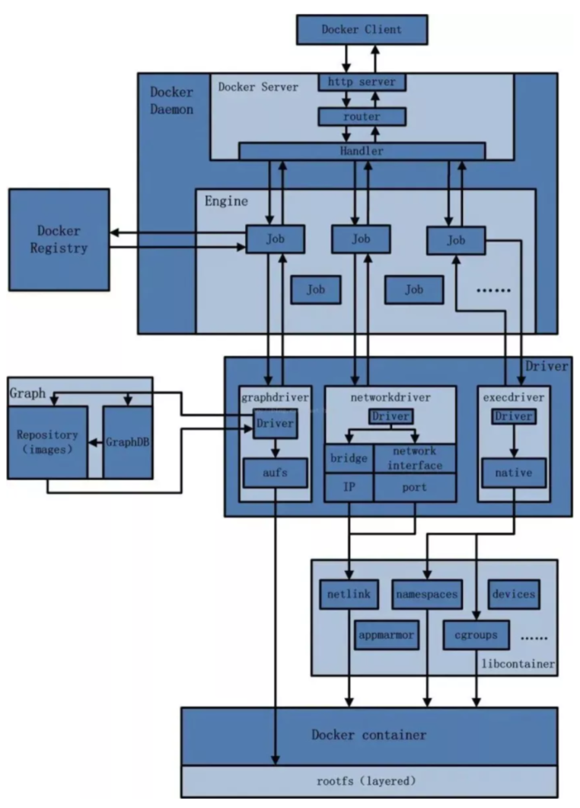

## 一、是什么？

#### docker不启动，默认网络情况


- ens33

- lo

- virbro
  
  在CentOS7的安装过程中如果有选择相关虚拟化的的服务安装系统后，启动网卡时会发现有一个以网桥连接的私网地址的virbr0网卡(virbr0网卡：它还有一个固定的默认IP地址192.168.122.1)，是做虚拟机网桥的使用的，其作用是为连接其上的虚机网卡提供 NAT访问外网的功能。
  
  我们之前学习Linux安装，勾选安装系统的时候附带了libvirt服务才会生成的一个东西，如果不需要可以直接将libvirtd服务卸载，
  
  yum remove libvirt-libs.x86_64

#### docker启动后的网络情况

安装docker后使用ipconfig命令查看会出现一个docker0的网路

查看docker网络模式(默认3种)

```sh
docker network ls
```


## 2、常用基本命令

#### All命令

```sh
docker network --help
```


#### 查看网络命令

```sh
docker network ls
```


####  查看网络源数据

```sh
docker network inspect xx网络名字
```


<br/>

#### 删除网路

```sh
docker network rm xx网络名称
```

#### 案例

```sh
# 创建网络
docker network create xx网络名称
# 查看网络
docker network ls
# 删除网络
docker network rm xx网络名称
```


## 3、能干嘛

#### 容器间的互联和通信以及端口映射

#### 容器IP变动的时候可以通过服务名直接网络通信而不受影响

## 4、网络模式

#### 总体接受

bridge模式：使用--network bridge指定，默认使用的docker0

host模式：使用--network host指定

none模式：使用--network  none指定

container模式：使用--network container:NAME或者容器id指定


#### 容器实例内默认网络IP生产规则

- 说明
  
   1 先启动两个ubuntu容器实例
  ```sh
  dcoker run -it --name u1 ubuntu bash
  docker run -it --name u2 ubuntu bash
  docker ps
  ```
  
  2 docker inspect 容器ID or容器名字
  ```sh
  docker inspect u1 | tail -n 20
  docker inspect u1 | tail -n 20
  ```
  
  
  
  
  
  3、关闭u2实例，新建u3查看ip变化
  ```sh
  # 停止u2
  docker stop u2
  # 查看u3实例
  docker inspect u3 | tail -n 20
  ```
  
  
  
  结论：docker容器内部的ip是有可能会发生变化的

#### 案例说明

1. bridge
   
   **是什么**
   
   Docker服务默认会创建一个docker0网桥（其上有一个docker0内部接口），该桥接网络的名称为docker0，它在内核层连通了其他的物理或虚拟网卡，这就将所有容器和本地主机都放到同一个物理网络。Docker默认指定了docker0接口IP地址和子网掩码，让主机和容器之间可以通过网桥相互通信
   ```
   # 查看bridge网络的详细信息，并通过grep获取名称项
   docker network inspect bridge | grep name
   # 查看ip docker网桥
   ifconfig | grep docker
   ```
   
   
   
    **案例**
   
   1 Docker使用Linux桥接，在宿主机虚拟一个Docker容器网桥(docker0)，Docker启动一个容器时会根据Docker网桥的网段分配给容器一个IP地址，称为Container-IP，同时Docker网桥是每个容器的默认网关。因为在同一宿主机内的容器都接入同一个网桥，这样容器之间就能够通过容器的Container-IP直接通信。
   
   2 docker run 的时候，没有指定network的话默认使用的网桥模式就是bridge，使用的就是docker0。在宿主机ifconfig,就可以看到docker0和自己create的network(后面讲)eth0，eth1，eth2……代表网卡一，网卡二，网卡三……，lo代表127.0.0.1，即localhost，inet addr用来表示网卡的IP地址
   
   3 网桥docker0创建一对对等虚拟设备接口一个叫veth，另一个叫eth0，成对匹配。
   
      3.1 整个宿主机的网桥模式都是docker0，类似一个交换机有一堆接口，每个接口叫veth，在本地主机和容器内分别创建一个虚拟接口，并让他们彼此联通（这样一对接口叫veth pair）；
   
      3.2 每个容器实例内部也有一块网卡，每个接口叫eth0；
   
      3.3 docker0上面的每个veth匹配某个容器实例内部的eth0，两两配对，一一匹配。
   
    通过上述，将宿主机上的所有容器都连接到这个内部网络上，两个容器在同一个网络下,会从这个网关下各自拿到分配的ip，此时两个容器的网络是互通的。
   
   
   
   代码
   ```sh
   # 启动两个tomcat
   docker run -d -p 8081:8080 --name tomcat81 billygoo/tomcat8-jdk8
   docker run -d -p 8082:8080 --name tomcat82 billygoo/tomcat8-jdk8
   ```
   
   验证两两匹配
   
   
   
   
   
   
2. hsot
   
   **是什么**
   
   直接使用宿主机的 IP 地址与外界进行通信，不再需要额外进行NAT 转换。
   
   **案例**
   
   说明：
   
      容器将不会获得一个独立的Network Namespace， 而是和宿主机共用一个Network Namespace。容器将不会虚拟出自己的网卡而是使用宿主机的IP和端口。
   
   
   
   代码：
   ```
   # 警告 此时设置的端口不起作用,默认还是8080,如果端口重复则端口递增
   docker run -d -p 8083:8080 --network host --name tomcat83 billygoo/tomcat8-jdk8
   # 正确
   docker run -d  --name tomcat83 billygoo/tomcat8-jdk8
   ```
   
   
   
   问题--docke启动时总是遇见标题中的警告
   
   原因--docker启动时指定--network=host或-net=host，如果还指定了-p映射端口，那这个时候就会有此警告，并且通过-p设置的参数将不会起到任何作用，端口号会以主机端口号为主，重复时则递增。
   
   解决--解决的办法就是使用docker的其他网络模式，例如--network=bridge，这样就可以解决问题，或者直接无视。。。。
   
   无之前的配对信息了，看容器实例内部：
   
   
   
   没有设置-p端口映射了，如何访问tomcat83:
   
   http://宿主机IP:8080/
   
   在CentOS里面用默认的火狐浏览器访问容器内的tomcat83看到访问成功，因为此时容器的IP借用主机的，
   
   所以容器共享宿主机网络IP，这样的好处是外部主机与容器可以直接通信。
3. none
   
   **是什么**
   
   禁用网络功能，只有lo标识（就是127.0.0.1表示本地回环）
   
   **案例**
   ```sh
   docker run -d -p 8084:8080 --network none --name tomcat84 billygoo/tomcat8-jdk8
   # 进入容器内部查看
   docker exec -it tomcat84 bash
   ip addr
   
   docker inspect tomcat84 | tail -n 20
   ```
   
   
   
   <br/>
4. container
   
   **是什么**
   
   container⽹络模式 
   
   新建的容器和已经存在的一个容器共享一个网络ip配置而不是和宿主机共享。新创建的容器不会创建自己的网卡，配置自己的IP，而是和一个指定的容器共享IP、端口范围等。同样，两个容器除了网络方面，其他的如文件系统、进程列表等还是隔离的。
   
   
   
   **错误案例**
   ```
   # 启动一个tomat容器
   docker run -d -p 8085:8080 --name tomcat85 billygoo/tomcat8-jdk8
   # 启动另外一个tomcat关联tomcat85网络
   docker run -d -p 8086:8080 --network container:tomcat85 --name tomcat86 billygoo/tomcat8-jdk8
   ```
   
   
   
   相当于tomcat86和tomcat85公用同一个ip同一个端口，导致端口冲突,本案例用tomcat演示不合适。。。演示坑。。换一个镜像给大家演示，
   
   **正确案例**
   
   Alpine Linux 是一款独立的、非商业的通用 Linux 发行版，专为追求安全性、简单性和资源效率的用户而设计。 可能很多人没听说过这个 Linux 发行版本，但是经常用 Docker 的朋友可能都用过，因为他小，简单，安全而著称，所以作为基础镜像是非常好的一个选择，可谓是麻雀虽小但五脏俱全，镜像非常小巧，不到 6M的大小，所以特别适合容器打包。
   ```
   docker run -it --name alpine1 alpine /bin/sh
   # 启动另外一个容器，关联alpine1网络
   docker run -it --network container:alpine1 --name alpine2 alpine /bin/sh
   ```
   
   运行结果验证，共用搭桥
   
   
   
   
   
   假如此时关闭alpine1，再看看alpine2
   
   
   
   
   
   可以发现eth0@if34消失了
5.  自定义网络
   
   **过时的link**
   
   官网已提示未来会淘汰掉link
   
   **案例**
   
   before
   
   案例：
   ```
   # 启动容器,然后进入容器内部相互ping对方ip
   docker run -d -p 8081:8080 --name tomcat81 billygoo/tomcat8-jdk8
   docker run -d -p 8082:8080 --name tomcat82 billygoo/tomcat8-jdk8
   ```
   
   
   
   
   
   问题：
   
   按照ip相互ping是可以的
   
   按照服务名ping是访问不通的
   
   
   
   
   
   after
   
   **案例**
   
   1、自定义桥接网络，自定义网络默认使用的是桥接网络bridge
   
   2、新建自定义网络
   ```
   # 查看docker网络
   docker network ls
   # 创建网络 amazecode_network
   docker network create amazecode_network
   ```
   
   
   
   3、新建容器加上上一步新建的自定义网络
   ```
   # 创建容器
   docker run -d -p 8081:8080 --network amazecode_network --name tomcat81 billygoo/tomcat8-jdk8
   docker run -d -p 8082:8080 --network amazecode_network --name tomcat82 billygoo/tomcat8-jdk8
   ```
   
   4、相互ping测试
   
   
   
   
   
   **结论：**
   
   自定义网络本身就维护好了主机名和ip的对应关系（ip和容器名都能ping通）

## 5、Docker平台架构图解

#### 整体说明

从其架构和运行流程来看，Docker 是一个 C/S 模式的架构，后端是一个松耦合架构，众多模块各司其职。 

Docker 运行的基本流程为：

1 用户是使用 Docker Client 与 Docker Daemon 建立通信，并发送请求给后者。

2 Docker Daemon 作为 Docker 架构中的主体部分，首先提供 Docker Server 的功能使其可以接受 Docker Client 的请求。

3 Docker Engine 执行 Docker 内部的一系列工作，每一项工作都是以一个 Job 的形式的存在。

4 Job 的运行过程中，当需要容器镜像时，则从 Docker Registry 中下载镜像，并通过镜像管理驱动 Graph driver将下载镜像以Graph的形式存储。

5 当需要为 Docker 创建网络环境时，通过网络管理驱动 Network driver 创建并配置 Docker 容器网络环境。

6 当需要限制 Docker 容器运行资源或执行用户指令等操作时，则通过 Execdriver 来完成。

7 Libcontainer是一项独立的容器管理包，Network driver以及Exec driver都是通过Libcontainer来实现具体对容器进行的操作。

#### 整体架构

