## 是什么？

Compose 是 Docker 公司推出的一个工具软件，可以管理多个 Docker 容器组成一个应用。你需要定义一个 YAML 格式的配置文件docker-compose.yml，写好多个容器之间的调用关系。然后，只要一个命令，就能同时启动/关闭这些容器

## 能干嘛?

 docker建议我们每一个容器中只运行一个服务,因为docker容器本身占用资源极少,所以最好是将每个服务单独的分割开来但是这样我们又面临了一个问题？

如果我需要同时部署好多个服务,难道要每个服务单独写Dockerfile然后在构建镜像,构建容器,这样累都累死了,所以docker官方给我们提供了docker-compose多服务部署的工具

例如要实现一个Web微服务项目，除了Web服务容器本身，往往还需要再加上后端的数据库mysql服务容器，redis服务器，注册中心eureka，甚至还包括负载均衡容器等等。。。。。。

Compose允许用户通过一个单独的docker-compose.yml模板文件（YAML 格式）来定义一组相关联的应用容器为一个项目（project）。

可以很容易地用一个配置文件定义一个多容器的应用，然后使用一条指令安装这个应用的所有依赖，完成构建。Docker-Compose 解决了容器与容器之间如何管理编排的问题。

## 去哪下？

#### 官网

https://docs.docker.com/compose/compose-file/compost-file-v3/

#### 官网下载

https://docs.docker.com/compose/install/

#### 安装步骤

最新发行的版本地址：https://github.com/docker/compose/releases。

```sh
# 要安装其他版本的 Compose，请替换 v2.17.3。
curl -L "https://github.com/docker/compose/releases/download/v2.17.3/docker-compose-$(uname -s)-$(uname -m)" -o /usr/local/bin/docker-compose
# Docker Compose 存放在 GitHub，不太稳定。
# 你可以也通过执行下面的命令，高速安装 Docker Compose。最新版本有可能更新不及时
curl -L https://get.daocloud.io/docker/compose/releases/download/v2.17.3/docker-compose-`uname -s`-`uname -m` > /usr/local/bin/docker-compose

chmod +x /usr/local/bin/docker-compose
docker-compose --version
```

#### 卸载步骤

如果您使用curl以下方式安装，则卸载Docker Dompose:

```sh
sudo rm /usr/local/bin/docker-compose
```

## Compose核心概念

#### 一文件

docker-compose.yml

#### 两要素

1. 服务(service)
   
   一个个应用容器实例，比如订单微服务、库存微服务、mysql容器、nginx容器或者redis容器
2. 工程（project）

		由一组关联的应用容器组成的一个完整业务单元，在docker-compose.yml文件中定义。

#### Compose使用的三个步骤

1. 编写Dockerfile定义各个微服务应用并构建出对应的镜像文件
2. 使用docker-compose.yml定义一个完整业务单元，安排好整体应用中的各个容器服务
3. 最后，执行docker-compose up命令来启动并运行整个应用程序，完成一键部署上线

#### Compose常用命令

Compose常用命令

docker-compose -h                           # 查看帮助

docker-compose up                           # 启动所有docker-compose服务

docker-compose up -d                        # 启动所有docker-compose服务并后台运行

docker-compose down                         # 停止并删除容器、网络、卷、镜像。

docker-compose exec  yml里面的服务id                 # 进入容器实例内部  docker-compose exec docker-compose.yml文件中写的服务id /bin/bash

docker-compose ps                      # 展示当前docker-compose编排过的运行的所有容器

docker-compose top                     # 展示当前docker-compose编排过的容器进程

docker-compose logs  yml里面的服务id     # 查看容器输出日志

docker-compose config     # 检查配置

docker-compose config -q  # 检查配置，有问题才有输出

docker-compose restart   # 重启服务

docker-compose start     # 启动服务

docker-compose stop      # 停止服务

#### Compose编排微服务

##### 改造升级微服务工程hello

1. 以前的基础版
   
   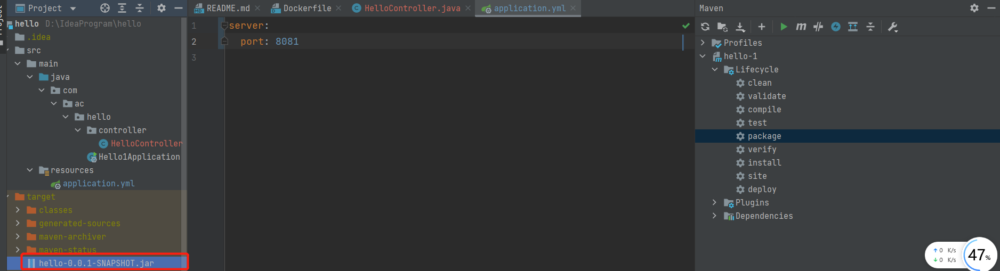
2. SQL建库表
   ```sql
   CREATE TABLE `t_user` (
     `id` int(10) unsigned NOT NULL AUTO_INCREMENT,
     `username` varchar(50) NOT NULL DEFAULT '' COMMENT '用户名',
     `password` varchar(50) NOT NULL DEFAULT '' COMMENT '密码',
     `sex` tinyint(4) NOT NULL DEFAULT '0' COMMENT '性别 0=女 1=男 ',
     `deleted` tinyint(4) unsigned NOT NULL DEFAULT '0' COMMENT '删除标志，默认0不删除，1删除',
     `update_time` timestamp NOT NULL DEFAULT CURRENT_TIMESTAMP ON UPDATE CURRENT_TIMESTAMP COMMENT '更新时间',
     `create_time` timestamp NOT NULL DEFAULT CURRENT_TIMESTAMP COMMENT '创建时间',
     PRIMARY KEY (`id`)
   ) ENGINE=InnoDB AUTO_INCREMENT=1 DEFAULT CHARSET=utf8 COMMENT='用户表'
   ```
3. 一键生成说明
4. 改POM
   ```xml
   <?xml version="1.0" encoding="UTF-8"?>
   <project xmlns="http://maven.apache.org/POM/4.0.0" xmlns:xsi="http://www.w3.org/2001/XMLSchema-instance"
            xsi:schemaLocation="http://maven.apache.org/POM/4.0.0 https://maven.apache.org/xsd/maven-4.0.0.xsd">
       <modelVersion>4.0.0</modelVersion>
       <parent>
           <groupId>org.springframework.boot</groupId>
           <artifactId>spring-boot-starter-parent</artifactId>
           <version>2.5.6</version>
           <!--<version>2.3.10.RELEASE</version>-->
           <relativePath/> <!-- lookup parent from repository -->
       </parent>
       <groupId>com.ac.hello</groupId>
       <artifactId>hello</artifactId>
       <version>0.0.1-SNAPSHOT</version>
       <name>hello-1</name>
       <description>hello-1</description>
       <properties>
           <springboot.version>2.5.6</springboot.version>
           <project.build.sourceEncoding>UTF-8</project.build.sourceEncoding>
           <maven.compiler.source>1.8</maven.compiler.source>
           <maven.compiler.target>1.8</maven.compiler.target>
           <junit.version>4.12</junit.version>
           <log4j.version>1.2.17</log4j.version>
           <lombok.version>1.16.18</lombok.version>
           <mysql.version>5.1.47</mysql.version>
           <druid.version>1.1.16</druid.version>
           <mapper.version>4.1.5</mapper.version>
           <mybatis.spring.boot.version>1.3.0</mybatis.spring.boot.version>
       </properties>
       <dependencies>
           <!--guava Google 开源的 Guava 中自带的布隆过滤器-->
           <dependency>
               <groupId>com.google.guava</groupId>
               <artifactId>guava</artifactId>
               <version>23.0</version>
           </dependency>
           <!-- redisson -->
           <dependency>
               <groupId>org.redisson</groupId>
               <artifactId>redisson</artifactId>
               <version>3.13.4</version>
           </dependency>
           <!--SpringBoot通用依赖模块-->
           <dependency>
               <groupId>org.springframework.boot</groupId>
               <artifactId>spring-boot-starter-web</artifactId>
               <version>${springboot.version}</version>
           </dependency>
           <dependency>
               <groupId>org.springframework.boot</groupId>
               <artifactId>spring-boot-starter-actuator</artifactId>
           </dependency>
           <!--swagger2-->
           <dependency>
               <groupId>io.springfox</groupId>
               <artifactId>springfox-swagger2</artifactId>
               <version>2.9.2</version>
           </dependency>
           <dependency>
               <groupId>io.springfox</groupId>
               <artifactId>springfox-swagger-ui</artifactId>
               <version>2.9.2</version>
           </dependency>
           <!--SpringBoot与Redis整合依赖-->
           <dependency>
               <groupId>org.springframework.boot</groupId>
               <artifactId>spring-boot-starter-data-redis</artifactId>
               <version>${springboot.version}</version>
           </dependency>
           <!--springCache-->
           <dependency>
               <groupId>org.springframework.boot</groupId>
               <artifactId>spring-boot-starter-cache</artifactId>
           </dependency>
           <!--springCache连接池依赖包-->
           <dependency>
               <groupId>org.apache.commons</groupId>
               <artifactId>commons-pool2</artifactId>
           </dependency>
           <!-- jedis -->
           <dependency>
               <groupId>redis.clients</groupId>
               <artifactId>jedis</artifactId>
               <version>3.1.0</version>
           </dependency>
           <!--Mysql数据库驱动-->
           <dependency>
               <groupId>mysql</groupId>
               <artifactId>mysql-connector-java</artifactId>
               <version>5.1.47</version>
           </dependency>
           <!--SpringBoot集成druid连接池-->
           <dependency>
               <groupId>com.alibaba</groupId>
               <artifactId>druid-spring-boot-starter</artifactId>
               <version>1.1.10</version>
           </dependency>
           <dependency>
               <groupId>com.alibaba</groupId>
               <artifactId>druid</artifactId>
               <version>${druid.version}</version>
           </dependency>
           <!--mybatis和springboot整合-->
           <dependency>
               <groupId>org.mybatis.spring.boot</groupId>
               <artifactId>mybatis-spring-boot-starter</artifactId>
               <version>${mybatis.spring.boot.version}</version>
           </dependency>
           <dependency>
               <groupId>commons-codec</groupId>
               <artifactId>commons-codec</artifactId>
               <version>1.10</version>
           </dependency>
           <!--通用基础配置junit/devtools/test/log4j/lombok/hutool-->
           <!--hutool-->
           <dependency>
               <groupId>cn.hutool</groupId>
               <artifactId>hutool-all</artifactId>
               <version>5.2.3</version>
           </dependency>
           <dependency>
               <groupId>junit</groupId>
               <artifactId>junit</artifactId>
               <version>${junit.version}</version>
           </dependency>
           <dependency>
               <groupId>org.springframework.boot</groupId>
               <artifactId>spring-boot-devtools</artifactId>
               <scope>runtime</scope>
               <optional>true</optional>
           </dependency>
           <dependency>
               <groupId>org.springframework.boot</groupId>
               <artifactId>spring-boot-starter-test</artifactId>
               <scope>test</scope>
           </dependency>
           <dependency>
               <groupId>log4j</groupId>
               <artifactId>log4j</artifactId>
               <version>${log4j.version}</version>
           </dependency>
           <dependency>
               <groupId>org.projectlombok</groupId>
               <artifactId>lombok</artifactId>
               <version>${lombok.version}</version>
               <optional>true</optional>
           </dependency>
           <!--persistence-->
           <dependency>
               <groupId>javax.persistence</groupId>
               <artifactId>persistence-api</artifactId>
               <version>1.0.2</version>
           </dependency>
           <!--通用Mapper-->
           <dependency>
               <groupId>tk.mybatis</groupId>
               <artifactId>mapper</artifactId>
               <version>${mapper.version}</version>
           </dependency>
       </dependencies>
   
       <build>
           <plugins>
               <plugin>
                   <groupId>org.springframework.boot</groupId>
                   <artifactId>spring-boot-maven-plugin</artifactId>
               </plugin>
               <plugin>
                   <groupId>org.apache.maven.plugins</groupId>
                   <artifactId>maven-resources-plugin</artifactId>
                   <version>3.1.0</version>
               </plugin>
           </plugins>
       </build>
   
   </project>
   
   ```
5. 写YML
   
   这里是application.properties配置
   ```properties
   server.port=8081
   # ========================alibaba.druid相关配置=====================
   spring.datasource.type=com.alibaba.druid.pool.DruidDataSource
   spring.datasource.driver-class-name=com.mysql.jdbc.Driver
   spring.datasource.url=jdbc:mysql://192.168.0.102:3306/db2021?useUnicode=true&characterEncoding=utf-8&useSSL=false
   spring.datasource.username=root
   spring.datasource.password=root
   spring.datasource.druid.test-while-idle=false
   # ========================redis相关配置=====================
   spring.redis.database=0
   spring.redis.host=192.168.0.102
   spring.redis.port=6379
   spring.redis.password=123456
   spring.redis.lettuce.pool.max-active=8
   spring.redis.lettuce.pool.max-wait=-1ms
   spring.redis.lettuce.pool.max-idle=8
   spring.redis.lettuce.pool.min-idle=0
   # ========================mybatis相关配置===================
   mybatis.mapper-locations=classpath:mapper/*.xml
   mybatis.type-aliases-package=com.ac.hello.entities
   # ========================swagger=====================
   spring.swagger2.enabled=true
   
   ```
6. 主启动类
   ```java
   package com.ac.hello;
   
   import tk.mybatis.spring.annotation.MapperScan;
   import org.springframework.boot.SpringApplication;
   import org.springframework.boot.autoconfigure.SpringBootApplication;
   
   @SpringBootApplication
   @MapperScan("com.ac.hello.mapper") //import tk.mybatis.spring.annotation.MapperScan;
   public class Hello1Application {
   
       public static void main(String[] args) {
           SpringApplication.run(Hello1Application.class, args);
       }
   
   }
   
   ```
7. 业务类
   
   config配置类(RedisConfig、SwaggerConfig)
   ```java
   @Configuration
   @Slf4j
   public class RedisConfig
   {
       /**
        * @param lettuceConnectionFactory
        * @return
        *
        * redis序列化的工具配置类，下面这个请一定开启配置
        * 127.0.0.1:6379> keys *
        * 1) "ord:102"  序列化过
        * 2) "\xac\xed\x00\x05t\x00\aord:102"   野生，没有序列化过
        */
       @Bean
       public RedisTemplate<String,Serializable> redisTemplate(LettuceConnectionFactory lettuceConnectionFactory)
       {
           RedisTemplate<String,Serializable> redisTemplate = new RedisTemplate<>();
   
           redisTemplate.setConnectionFactory(lettuceConnectionFactory);
           //设置key序列化方式string
           redisTemplate.setKeySerializer(new StringRedisSerializer());
           //设置value的序列化方式json
           redisTemplate.setValueSerializer(new GenericJackson2JsonRedisSerializer());
   
           redisTemplate.setHashKeySerializer(new StringRedisSerializer());
           redisTemplate.setHashValueSerializer(new GenericJackson2JsonRedisSerializer());
   
           redisTemplate.afterPropertiesSet();
   
           return redisTemplate;
       }
   
   }
   ```
   ```java
   @Configuration
   @EnableSwagger2
   public class SwaggerConfig
   {
       @Value("${spring.swagger2.enabled}")
       private Boolean enabled;
   
       @Bean
       public Docket createRestApi() {
           return new Docket(DocumentationType.SWAGGER_2)
                   .apiInfo(apiInfo())
                   .enable(enabled)
                   .select()
                   .apis(RequestHandlerSelectors.basePackage("com.atguigu.docker")) //你自己的package
                   .paths(PathSelectors.any())
                   .build();
       }
   
       public ApiInfo apiInfo() {
           return new ApiInfoBuilder()
                   .title("尚硅谷Java大厂技术"+"\t"+new SimpleDateFormat("yyyy-MM-dd").format(new Date()))
                   .description("docker-compose")
                   .version("1.0")
                   .termsOfServiceUrl("https://www.atguigu.com/")
                   .build();
       }
   }
   
   ```
   
   新建Entity
   ```java
   package com.ac.hello.entity;
   
   import javax.persistence.Column;
   import javax.persistence.GeneratedValue;
   import javax.persistence.Id;
   import javax.persistence.Table;
   import java.util.Date;
   
   @Table(name = "t_user")
   public class User
   {
       @Id
       @GeneratedValue(generator = "JDBC")
       private Integer id;
   
       /**
        * 用户名
        */
       private String username;
   
       /**
        * 密码
        */
       private String password;
   
       /**
        * 性别 0=女 1=男
        */
       private Byte sex;
   
       /**
        * 删除标志，默认0不删除，1删除
        */
       private Byte deleted;
   
       /**
        * 更新时间
        */
       @Column(name = "update_time")
       private Date updateTime;
   
       /**
        * 创建时间
        */
       @Column(name = "create_time")
       private Date createTime;
   
       /**
        * @return id
        */
       public Integer getId() {
           return id;
       }
   
       /**
        * @param id
        */
       public void setId(Integer id) {
           this.id = id;
       }
   
       /**
        * 获取用户名
        *
        * @return username - 用户名
        */
       public String getUsername() {
           return username;
       }
   
       /**
        * 设置用户名
        *
        * @param username 用户名
        */
       public void setUsername(String username) {
           this.username = username;
       }
   
       /**
        * 获取密码
        *
        * @return password - 密码
        */
       public String getPassword() {
           return password;
       }
   
       /**
        * 设置密码
        *
        * @param password 密码
        */
       public void setPassword(String password) {
           this.password = password;
       }
   
       /**
        * 获取性别 0=女 1=男
        *
        * @return sex - 性别 0=女 1=男
        */
       public Byte getSex() {
           return sex;
       }
   
       /**
        * 设置性别 0=女 1=男
        *
        * @param sex 性别 0=女 1=男
        */
       public void setSex(Byte sex) {
           this.sex = sex;
       }
   
       /**
        * 获取删除标志，默认0不删除，1删除
        *
        * @return deleted - 删除标志，默认0不删除，1删除
        */
       public Byte getDeleted() {
           return deleted;
       }
   
       /**
        * 设置删除标志，默认0不删除，1删除
        *
        * @param deleted 删除标志，默认0不删除，1删除
        */
       public void setDeleted(Byte deleted) {
           this.deleted = deleted;
       }
   
       /**
        * 获取更新时间
        *
        * @return update_time - 更新时间
        */
       public Date getUpdateTime() {
           return updateTime;
       }
   
       /**
        * 设置更新时间
        *
        * @param updateTime 更新时间
        */
       public void setUpdateTime(Date updateTime) {
           this.updateTime = updateTime;
       }
   
       /**
        * 获取创建时间
        *
        * @return create_time - 创建时间
        */
       public Date getCreateTime() {
           return createTime;
       }
   
       /**
        * 设置创建时间
        *
        * @param createTime 创建时间
        */
       public void setCreateTime(Date createTime) {
           this.createTime = createTime;
       }
   }
   ```
   
   新建mapper
   ```java
   package com.ac.hello.mapper;
   
   import com.ac.hello.entity.User;
   import tk.mybatis.mapper.common.Mapper;
   
   public interface UserMapper extends Mapper<User> {
   }
   
   ```
   
   新建servcie
   ```java
   package com.ac.hello.service;
   
   import com.ac.hello.entity.User;
   import com.ac.hello.mapper.UserMapper;
   import lombok.extern.slf4j.Slf4j;
   import org.springframework.data.redis.core.RedisTemplate;
   import org.springframework.stereotype.Service;
   
   import javax.annotation.Resource;
   
   @Service
   @Slf4j
   public class UserService {
   
       public static final String CACHE_KEY_USER = "user:";
   
       @Resource
       private UserMapper userMapper;
       @Resource
       private RedisTemplate redisTemplate;
   
       /**
        * addUser
        * @param user
        */
       public void addUser(User user)
       {
           //1 先插入mysql并成功
           int i = userMapper.insertSelective(user);
   
           if(i > 0)
           {
               //2 需要再次查询一下mysql将数据捞回来并ok
               user = userMapper.selectByPrimaryKey(user.getId());
               //3 将捞出来的user存进redis，完成新增功能的数据一致性。
               String key = CACHE_KEY_USER+user.getId();
               redisTemplate.opsForValue().set(key,user);
           }
       }
   
       /**
        * findUserById
        * @param id
        * @return
        */
       public User findUserById(Integer id)
       {
           User user = null;
           String key = CACHE_KEY_USER+id;
   
           //1 先从redis里面查询，如果有直接返回结果，如果没有再去查询mysql
           user = (User) redisTemplate.opsForValue().get(key);
   
           if(user == null)
           {
               //2 redis里面无，继续查询mysql
               user = userMapper.selectByPrimaryKey(id);
               if(user == null)
               {
                   //3.1 redis+mysql 都无数据
                   //你具体细化，防止多次穿透，我们规定，记录下导致穿透的这个key回写redis
                   return user;
               }else{
                   //3.2 mysql有，需要将数据写回redis，保证下一次的缓存命中率
                   redisTemplate.opsForValue().set(key,user);
               }
           }
           return user;
       }
   }
   ```
   
   新建controller
   ```java
   package com.ac.hello.controller;
   
   import cn.hutool.core.util.IdUtil;
   import com.ac.hello.entity.User;
   import com.ac.hello.service.UserService;
   import io.swagger.annotations.Api;
   import io.swagger.annotations.ApiOperation;
   import lombok.extern.slf4j.Slf4j;
   import org.springframework.web.bind.annotation.*;
   
   import javax.annotation.Resource;
   import java.util.Random;
   
   @Api(description = "用户User接口")
   @RestController
   @Slf4j
   public class UserController
   {
       @Resource
       private UserService userService;
   
       @ApiOperation("数据库新增3条记录")
       @RequestMapping(value = "/user/add",method = RequestMethod.POST)
       public void addUser()
       {
           for (int i = 1; i <=3; i++) {
               User user = new User();
   
               user.setUsername("zzyy"+i);
               user.setPassword(IdUtil.simpleUUID().substring(0,6));
               user.setSex((byte) new Random().nextInt(2));
   
               userService.addUser(user);
           }
       }
   
       @ApiOperation("查询1条记录")
       @RequestMapping(value = "/user/find/{id}",method = RequestMethod.GET)
       public User findUserById(@PathVariable Integer id)
       {
           return userService.findUserById(id);
       }
   }
   ```
8. mvn package命令将微服务形成新的jar包并上传到linux服务器/data/docker/myservice02目录下
9. 编写Dockerfile
   ```dockerfile
   # 基础镜像使用java
   FROM java:8
   # 作者
   MAINTAINER amazecode
   
   # VOLUME 指定临时文件目录为/tmp，在主机/var/lib/docker目录下创建了一个临时文件并链接到容器的/tmp
   VOLUME /tmp
   
   # 将jar包添加到容器中并更名为zzyy_docker.jar
   ADD hello-0.0.1-SNAPSHOT.jar app.jar
   
   # 运行jar包
   RUN bash -c 'touch /app.jar'
   
   ENTRYPOINT ["java","-jar","/app.jar"]
   
   #暴露8081端口作为微服务
   EXPOSE 8081
   ```
10. 构建镜像
    ```sh
    # 编译
    docker build -t ac_hello:1.1 .
    # 运行
    docker run -d -p 8081:8081 --name ac_hello ac_hello:1.1
    ```
    
    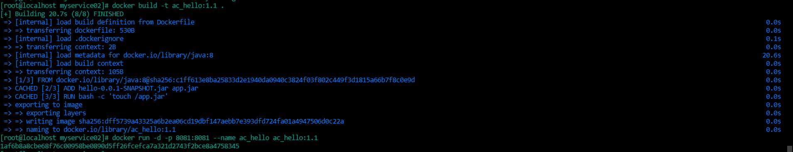
11. 测试
    
    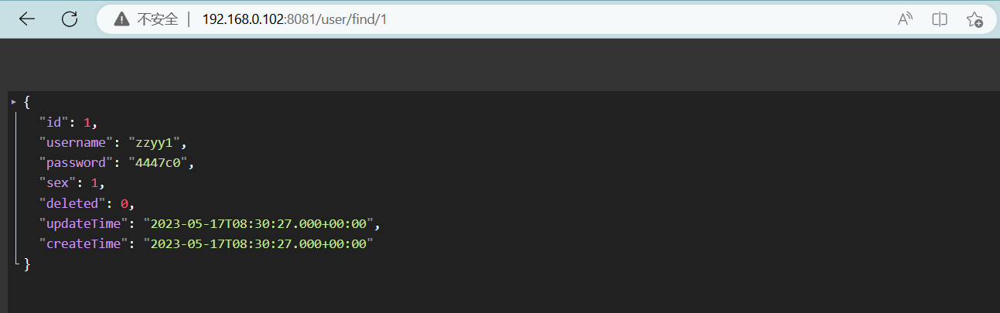
    
    <br/>

#### 不用Compose

1. 单独的mysql容器实例
   
   新建mysql容器实例
   ```sh
   docker run -d -p 3306:3306 --privileged=true -v /data/docker/mysql/log:/var/log/mysql -v /data/docker/mysql/data:/var/lib/mysql -v /data/docker/mysql/conf:/etc/mysql/conf.d -e MYSQL_ROOT_PASSWORD=root  --name mysql mysql:5.7
   ```
   
   进入mysql容器实例并新建库db2021+新建表t_user
   ```sql
   docker exec -it mysql57 /bin/bash
   mysql -uroot -p
   create database db2021;
   use db2021;
   
   CREATE TABLE `t_user` (
     `id` INT(10) UNSIGNED NOT NULL AUTO_INCREMENT,
     `username` VARCHAR(50) NOT NULL DEFAULT '' COMMENT '用户名',
     `password` VARCHAR(50) NOT NULL DEFAULT '' COMMENT '密码',
     `sex` TINYINT(4) NOT NULL DEFAULT '0' COMMENT '性别 0=女 1=男 ',
     `deleted` TINYINT(4) UNSIGNED NOT NULL DEFAULT '0' COMMENT '删除标志，默认0不删除，1删除',
     `update_time` TIMESTAMP NOT NULL DEFAULT CURRENT_TIMESTAMP ON UPDATE CURRENT_TIMESTAMP COMMENT '更新时间',
     `create_time` TIMESTAMP NOT NULL DEFAULT CURRENT_TIMESTAMP COMMENT '创建时间',
     PRIMARY KEY (`id`)
   ) ENGINE=INNODB AUTO_INCREMENT=1 DEFAULT CHARSET=utf8mb4 COMMENT='用户表';
   ```
2. 单独的redis容器实例
   ```sh
   docker run --name redis -p 6379:6379 -v /data/docker/redis/conf:/usr/local/etc/redis -v /data/docker/redis/data:/data -d redis:7.0.11 redis-server /usr/local/etc/redis/redis.conf
   ```
3. 微服务工程
   ```sh
   # 运行
   docker run -d -p 8081:8081 --name ac_hello ac_hello:1.1
   ```
4. 三个容器启动成功
   
   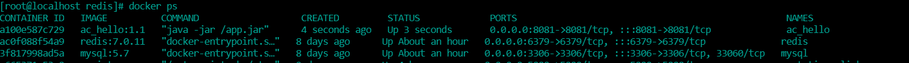

#### swagger测试

```
http://ip:端口号/swagger-ui.html#/
```

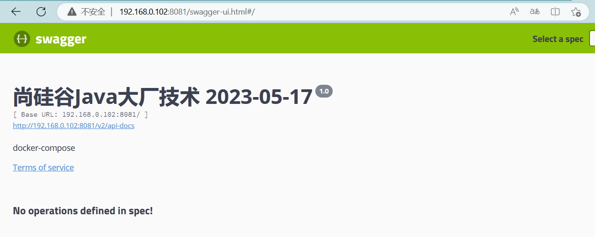

## 上面成功了，有哪些问题？

#### 先后顺序要求固定，先mysql+redis才能微服务访问成功

#### 多个run命令。。。

#### 容器间的停机或宕机，有可能导致IP地址对应的容器实例变化，映射出错，要么生产IP写死（可以但是不推荐），要么通过服务调用

## 使用compose

#### 1、服务编排，一套带走

#### 2、编写docker-compose.yml文件

```yaml
version: "3"

services:
  acComposeHello:
    image: ac_hello:1.2
    container_name: ac_compose_hello
    ports:
      - "8081:8081"
    volumes:
      - /data/docker/myservice02/data:/data
    networks: 
      - ac_net 
    depends_on: 
      - redis
      - mysql
  redis:
    image: redis:7.0.11
    container_name: compose_redis:7.0.11
    ports:
      - "6379:6379"
    volumes:
      - /data/docker/redis/conf:/usr/local/etc/redis
      - /data/docker/redis/data:/data
    networks: 
      - ac_net
    command: redis-server /usr/local/etc/redis/redis.conf
  mysql:
    image: mysql:5.7
    container_name: compose_mysql:5.7
    environment:
      MYSQL_ROOT_PASSWORD: 'root'
      MYSQL_ALLOW_EMPTY_PASSWORD: 'no'
      MYSQL_DATABASE: 'db2021'
      MYSQL_USER: 'amazecode'
      MYSQL_PASSWORD: '123456'
    ports:
       - "3306:3306"
    volumes:
       - /data/docker/mysql/data:/var/lib/mysql
       - /data/docker/mysql/conf:/etc/mysql/conf.d
       - /data/docker/mysql/init:/docker-entrypoint-initdb.d
    networks:
      - ac_net
    command: --default-authentication-plugin=mysql_native_password #解决外部无法访问
networks: 
  # 自定义网络
   ac_net: 
```

#### 3、再次修改微服务

1. 修改配置文件
   
   通过服务名访问，IP无关
   ```properties
   server.port=8081
   # ========================alibaba.druid=====================
   spring.datasource.type=com.alibaba.druid.pool.DruidDataSource
   spring.datasource.driver-class-name=com.mysql.jdbc.Driver
   #spring.datasource.url=jdbc:mysql://192.168.0.102:3306/db2021?useUnicode=true&characterEncoding=utf-8&useSSL=false
   spring.datasource.url=jdbc:mysql://mysql:3306/db2021?useUnicode=true&characterEncoding=utf-8&useSSL=false
   spring.datasource.username=root
   spring.datasource.password=root
   spring.datasource.druid.test-while-idle=false
   # ========================redis=====================
   spring.redis.database=0
   #spring.redis.host=192.168.0.102
   spring.redis.host=redis
   spring.redis.port=6379
   spring.redis.password=123456
   spring.redis.lettuce.pool.max-active=8
   spring.redis.lettuce.pool.max-wait=-1ms
   spring.redis.lettuce.pool.max-idle=8
   spring.redis.lettuce.pool.min-idle=0
   # ========================mybatis===================
   mybatis.mapper-locations=classpath:mapper/*.xml
   mybatis.type-aliases-package=com.ac.hello.entities
   # ========================swagger=====================
   spring.swagger2.enabled=true
   
   ```
2. mvn package命令将微服务形成新的jar包并上传到Linux服务器/data/docker/mycompose目录下
3. 编写Dockerfile
   ```dockerfile
   # 基础镜像使用java
   FROM java:8
   # 作者
   MAINTAINER amazecode
   
   # VOLUME 指定临时文件目录为/tmp，在主机/var/lib/docker目录下创建了一个临时文件并链接到容器的/tmp
   VOLUME /tmp
   
   # 将jar包添加到容器中并更名为zzyy_docker.jar
   ADD hello-0.0.1-SNAPSHOT.jar app.jar
   
   # 运行jar包
   RUN bash -c 'touch /app.jar'
   
   ENTRYPOINT ["java","-jar","/app.jar"]
   
   #暴露8081端口作为微服务
   EXPOSE 8081
   ```
   
   
4. 构建镜像
   ```sh
   docker build -t ac_hello:1.2 .
   ```
   
   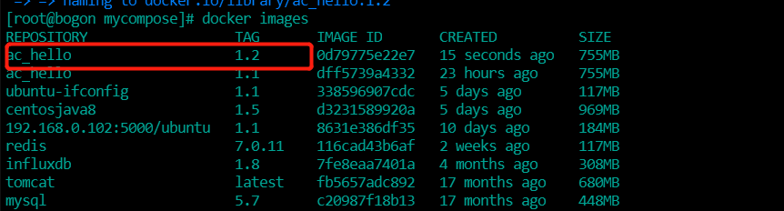

#### 4、执行compose启动命令

```sh
# 启动
docker-compose up
# 台启动
docker-compose up -d
```

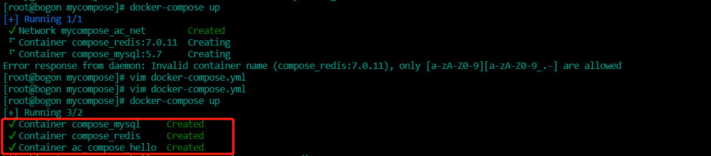

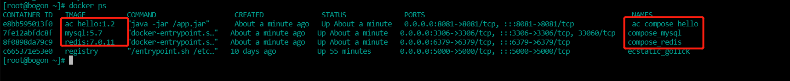

如上图显示代表容器启动成功

#### 5、进入myslq容器实例并新建db2021+新建t_user

```sh
# 进入容器
docker exec -it 容器实例id /bin/bash
mysql -uroot -p
create database db2021;
use db2021;

CREATE TABLE `t_user` (
  `id` INT(10) UNSIGNED NOT NULL AUTO_INCREMENT,
  `username` VARCHAR(50) NOT NULL DEFAULT '' COMMENT '用户名',
  `password` VARCHAR(50) NOT NULL DEFAULT '' COMMENT '密码',
  `sex` TINYINT(4) NOT NULL DEFAULT '0' COMMENT '性别 0=女 1=男 ',
  `deleted` TINYINT(4) UNSIGNED NOT NULL DEFAULT '0' COMMENT '删除标志，默认0不删除，1删除',
  `update_time` TIMESTAMP NOT NULL DEFAULT CURRENT_TIMESTAMP ON UPDATE CURRENT_TIMESTAMP COMMENT '更新时间',
  `create_time` TIMESTAMP NOT NULL DEFAULT CURRENT_TIMESTAMP COMMENT '创建时间',
  PRIMARY KEY (`id`)
) ENGINE=INNODB AUTO_INCREMENT=1 DEFAULT CHARSET=utf8mb4 COMMENT='用户表';
```

#### 6、测试通过

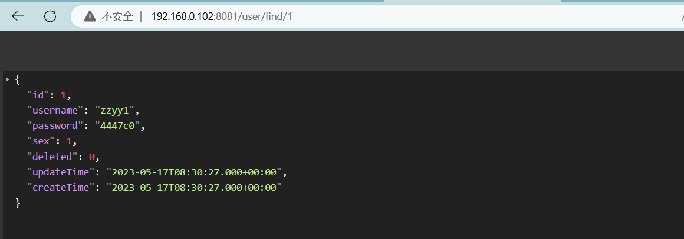

#### 7、Compose常用命令

```
Compose常用命令
docker-compose -h                           # 查看帮助
docker-compose up                           # 启动所有docker-compose服务
docker-compose up -d                        # 启动所有docker-compose服务并后台运行
docker-compose down                         # 停止并删除容器、网络、卷、镜像。
docker-compose exec  yml里面的服务id        # 进入容器实例内部  docker-compose exec docker-compose.yml文件中写的服务id /bin/bash 例如：docker-compose exec acComposeHello /bin/bash
docker-compose ps                           # 展示当前docker-compose编排过的运行的所有容器
docker-compose top                          # 展示当前docker-compose编排过的容器进程

docker-compose logs  yml里面的服务id        # 查看容器输出日志
dokcer-compose config     # 检查配置
dokcer-compose config -q  # 检查配置，有问题才有输出
docker-compose restart   # 重启服务
docker-compose start     # 启动服务
docker-compose stop      # 停止服务
```

注意:docker-compose 命令执行的时候需要在docker-compose.yml所在目录执行

#### 8、停止并删除容器、网路、卷、镜像

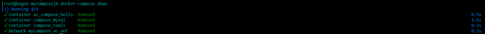

## 使用docker-compose一体化构建镜像和容器

#### 1、Dockerfile、docker-compose.yml以及jar包放到同一级目录

正常也可以放置到不在同一级目录，实际中根据目录位置调整配置即可

#### 2、Dockerfile配置不变

```dockerfile
# 基础镜像使用java
FROM java:8
# 作者
MAINTAINER amazecode

# VOLUME 指定临时文件目录为/tmp，在主机/var/lib/docker目录下创建了一个临时文件并链接到容器的/tmp
VOLUME /tmp

# 将jar包添加到容器中并更名为zzyy_docker.jar
ADD hello-0.0.1-SNAPSHOT.jar app.jar

# 运行jar包
RUN bash -c 'touch /app.jar'

ENTRYPOINT ["java","-jar","/app.jar"]

#暴露8081端口作为微服务
EXPOSE 8081
```

#### 3、变更docker-compose.yml配置

```yaml
version: "3"

services:
  # 项目id自定义
  acComposeHello:
    build:
      # 指定Dockerfile所在目录
      context: ./  
      # 指定Dockerfile的文件名
      dockerfile: Dockerfile
    # 如果同时指定了build和image两个标签，那么Compose会构建镜像并把镜像命名为image后面的那个名字
    image: ac_compose_hello:1.0
    # 自定义容器名
    container_name: ac_compose_hello
    ports:
      - "8081:8081"
    volumes:
      - /data/docker/myservice02/data:/data
    networks: 
      - ac_net 
    depends_on: 
      - redis
      - mysql
  redis:
    image: redis:7.0.11
    container_name: compose_redis
    ports:
      - "6379:6379"
    volumes:
      - /data/docker/redis/conf:/usr/local/etc/redis
      - /data/docker/redis/data:/data
    networks: 
      - ac_net
    command: redis-server /usr/local/etc/redis/redis.conf
  mysql:
    image: mysql:5.7
    container_name: compose_mysql
    environment:
      MYSQL_ROOT_PASSWORD: 'root'
      MYSQL_ALLOW_EMPTY_PASSWORD: 'no'
      MYSQL_DATABASE: 'db2021'
      MYSQL_USER: 'amazecode'
      MYSQL_PASSWORD: '123456'
    ports:
       - "3306:3306"
    volumes:
       - /data/docker/mysql/data:/var/lib/mysql
       - /data/docker/mysql/conf:/etc/mysql/conf.d
       - /data/docker/mysql/init:/docker-entrypoint-initdb.d
    networks:
      - ac_net
    command: --default-authentication-plugin=mysql_native_password #解决外部无法访问
networks: 
  # 自定义网络
  ac_net: 
```

新增build配置，build和image标签同时出现时，image标签对应的名称，即是编译的镜像名称

#### 4、启动编排

```
# 如果docker-compose.yaml中的某些镜像有改动，使用此命令重新打包镜像，并运行
docker-compose up --build
# 后台运行
docker-compose up --build -d
```

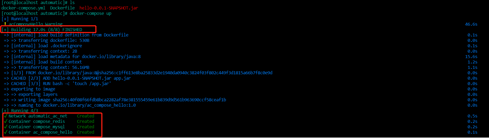

#### 5、别忘记进入myslq容器实例并新建db2021+新建t_user

```sql
# 进入容器
docker exec -it 容器实例id /bin/bash
mysql -uroot -p
create database db2021;
use db2021;

CREATE TABLE `t_user` (
  `id` INT(10) UNSIGNED NOT NULL AUTO_INCREMENT,
  `username` VARCHAR(50) NOT NULL DEFAULT '' COMMENT '用户名',
  `password` VARCHAR(50) NOT NULL DEFAULT '' COMMENT '密码',
  `sex` TINYINT(4) NOT NULL DEFAULT '0' COMMENT '性别 0=女 1=男 ',
  `deleted` TINYINT(4) UNSIGNED NOT NULL DEFAULT '0' COMMENT '删除标志，默认0不删除，1删除',
  `update_time` TIMESTAMP NOT NULL DEFAULT CURRENT_TIMESTAMP ON UPDATE CURRENT_TIMESTAMP COMMENT '更新时间',
  `create_time` TIMESTAMP NOT NULL DEFAULT CURRENT_TIMESTAMP COMMENT '创建时间',
  PRIMARY KEY (`id`)
) ENGINE=INNODB AUTO_INCREMENT=1 DEFAULT CHARSET=utf8mb4 COMMENT='用户表';

# 别忘记插入数据
```

#### 6、验证服务

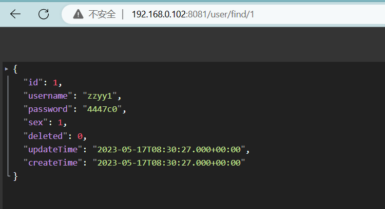
