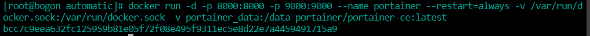
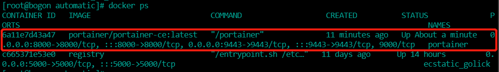
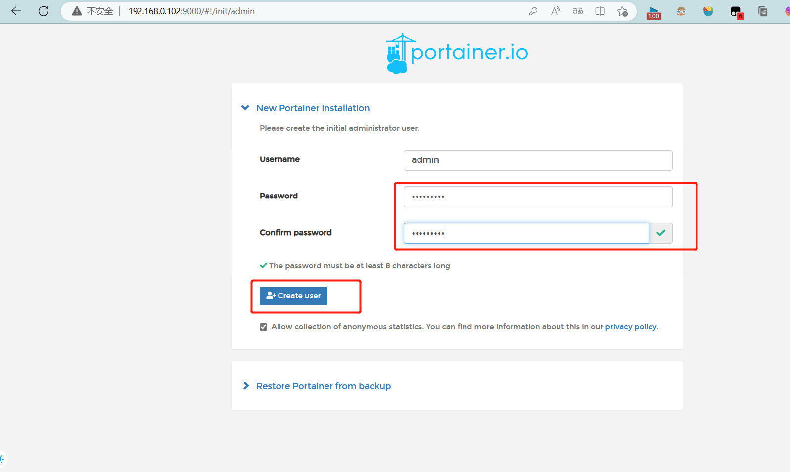
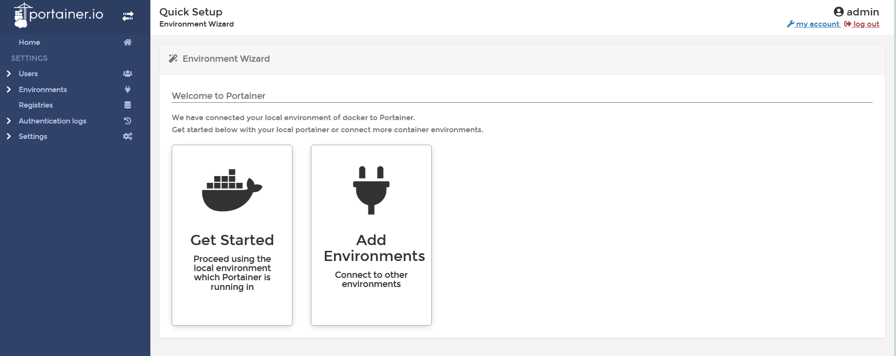
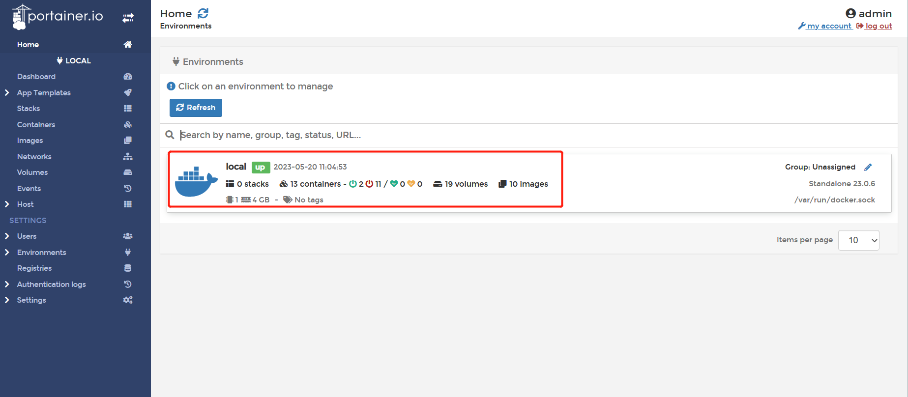
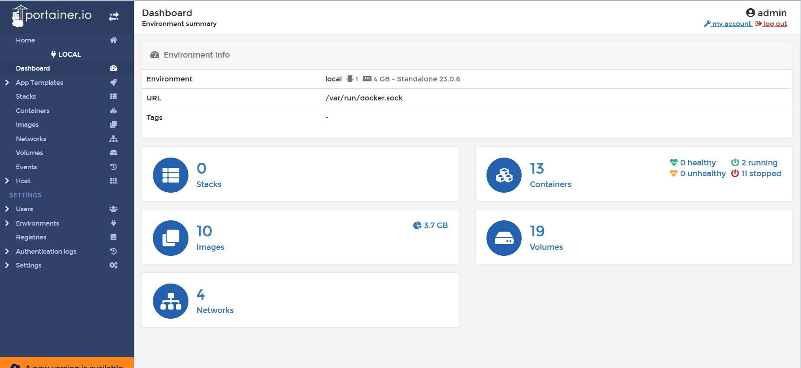

## 是什么?

Portainer 是一款轻量级的应用，它提供了图形化界面，用于方便地管理Docker环境，包括单机环境和集群环境。

## 安装

#### 1、官网

[https://www.portainer.io/](https://www.portainer.io/)

[官网docker方式安装教程](https://docs.portainer.io/start/install-ce/server/docker/linux)

#### 2、步骤

1. docker命令安装
   
   创建数据卷用来存储Portainer Server数据
   ```sh
   docker volume create portainer_data
   ```
   
   下载安装portainer server 容器
   ```sh
   # 此方式开放9443端口只能使用https方式访问
   docker run -d -p 8000:8000 -p 9443:9443 --name portainer --restart=always -v /var/run/docker.sock:/var/run/docker.sock -v portainer_data:/data portainer/portainer-ce:latest
   # 如果需要使用http方式访问，需要开发9000端口
   docker run -d -p 8000:8000 -p 9000:9000 --name portainer --restart=always -v /var/run/docker.sock:/var/run/docker.sock -v portainer_data:/data portainer/portainer-ce:latest
   
   # 注意开放9443、9000端口，以免访问不到
   firewall-cmd --zone=public --add-port=9443/tcp --permanent
   firewall-cmd --zone=public --add-port=9000/tcp --permanent
   # 重新加载防火墙
   firewall-cmd --reload
   ```
   
   
   
   
   
   这里采用http方式访问为例
2. 第一次登陆需要创建admin,访问地址https://xxx.xx.xx.xxx:9000
   
   用户名直接用默认admin，密码记得8位，随便自定义(123456789)
   
   
   
   设置好密码点击create user进入主界面，点击Get Started会自连接本地docker
   
   
3. 选择local选项卡后本地docker详细信息展示
   
   
   
   
4. 上一步图像展示对应的命令
   ```sh
   docker system df
   ```
   
   
   
   