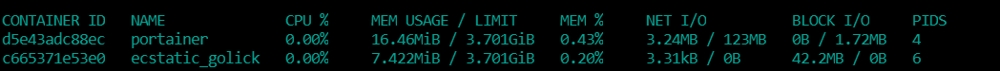
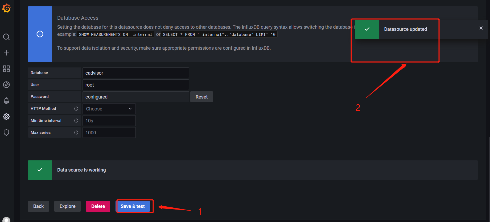
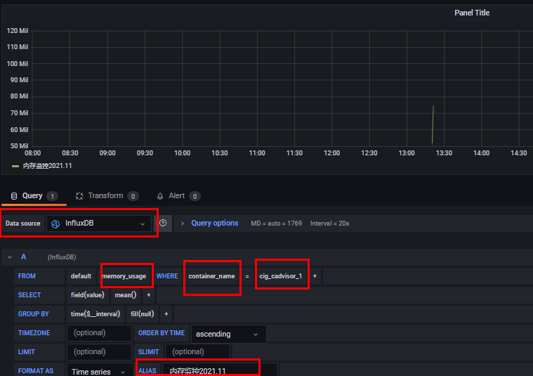

## 一、原生命令

#### 1、操作

```sh
# 查看运行容器
docker ps
# dockers监控状态
docker stats
```


docker stats命令执行结果



#### 2、问题

通过docker stats命令可以很方便的看到当前宿主机上所有容器的CPU,内存以及网络流量等数据，一般小公司够用了。。。。但是，docker stats统计结果只能是当前宿主机的全部容器，数据资料是实时的，没有地方存储、没有健康指标过线预警等功能

## 二、是什么

#### 1、监控3剑客

1. 一句话
   
   
   
   CAdvisor监控收集+InfluxDB存储数据+Grafana展示图标
2. CAdvisor
   
   
3. InfluxDB
   
   
4. Grafana
   
   
5. 总结
   
   

#### 3、compose容器编排，一套带走

1. 新建目录
   ```
   mkdir /data/docker/cig
   ```
   
   
2. 新建3件套组合的docker-compose.yml
   
   版本一：使用link关联容器(link后续会被移除不推荐)
   ```yaml
   version: '3.1'
   
   volumes:
     grafana_data: {}
   
   services:
    influxdb:
     image: tutum/influxdb:0.9
     restart: always
     environment:
       - PRE_CREATE_DB=cadvisor
     ports:
       - "8083:8083"
       - "8086:8086"
     volumes:
       - ./data/influxdb:/data
    cadvisor:
     image: google/cadvisor
     links:
       - influxdb:influxsrv
     command: -storage_driver=influxdb -storage_driver_db=cadvisor -storage_driver_host=influxsrv:8086
     restart: always
     ports:
       - "8080:8080"
     volumes:
       - /:/rootfs:ro
       - /var/run:/var/run:rw
       - /sys:/sys:ro
       - /var/lib/docker/:/var/lib/docker:ro
    grafana:
     user: "104"
     image: grafana/grafana
     restart: always
     links:
       - influxdb:influxsrv
     ports:
       - "3000:3000"
     volumes:
       - grafana_data:/var/lib/grafana
     environment:
       - HTTP_USER=admin
       - HTTP_PASS=admin
       - INFLUXDB_HOST=influxsrv
       - INFLUXDB_PORT=8086
       - INFLUXDB_NAME=cadvisor
       - INFLUXDB_USER=root
       - INFLUXDB_PASS=root
   ```
   
   版本二：使用depends_on和networks关联容器
   ```yaml
   version: '3.1'
   
   volumes:
     grafana_data: {}
   
   services:
    influxdb:
     image: tutum/influxdb:0.9
     restart: always
     environment:
       - PRE_CREATE_DB=cadvisor
     ports:
       - "8083:8083"
       - "8086:8086"
     volumes:
       - ./data/influxdb:/data
     networks:
       - cignetwork
    cadvisor:
     image: google/cadvisor
     # links:
     #  - influxdb:influxsrv
     #command: -storage_driver=influxdb -storage_driver_db=cadvisor -storage_driver_host=influxsrv:8086
     command: -storage_driver=influxdb -storage_driver_db=cadvisor -storage_driver_host=influxdb:8086
     restart: always
     ports:
       - "8080:8080"
     volumes:
       - /:/rootfs:ro
       - /var/run:/var/run:rw
       - /sys:/sys:ro
       - /var/lib/docker/:/var/lib/docker:ro
     depends_on: 
       - influxdb
     networks:
       - cignetwork
    grafana:
     user: "104"
     image: grafana/grafana
     restart: always
     links:
       - influxdb:influxsrv
     ports:
       - "3000:3000"
     volumes:
       - grafana_data:/var/lib/grafana
     environment:
       - HTTP_USER=admin
       - HTTP_PASS=admin
       - INFLUXDB_HOST=influxdb
       - INFLUXDB_PORT=8086
       - INFLUXDB_NAME=cadvisor
       - INFLUXDB_USER=root
       - INFLUXDB_PASS=root
     depends_on:
       - influxdb
       - cadvisor
     networks:
       - cignetwork
   
   
   # 自定义网络
   networks:
     cignetwork:
       driver: bridge
   ```
3. 启动docker-compose文件
   ```sh
   docker-compose up
   ```
   
   
4. 查看三个服务容器是否启动
   ```sh
   docker ps
   ```
   
   
5. 测试
   ```
   # 开放相应端口号 cAdvisor 8080 influxDB 8083 grafana 3000
   firewall-cmd --zone=public --add-port=3000/tcp --permanent
   firewall-cmd --zone=public --add-port=8080/tcp --permanent
   firewall-cmd --zone=public --add-port=8083/tcp --permanent
   
   firewall-cmd --reload
   ```

浏览cAdvisor收集服务，http://ip:8080/,第一次访问慢，CAdvisor也有基础的图形展示功能，这里主要用它来做数据采集


浏览influxdb存储服务，http://ip:8083


浏览grafana展现服务，http://ip:3000,默认账户密码（admin/admin）


配置步骤

1. 配置数据源
   
   
2. 选择InfluxDB数据源
   
   
   
   <br/>
3. 配置细节
   
   
   
   
   
   
4. 配置面板panel
   
   
   
   
   
   
   
   
   
   
   
   
   
   
   
   点进去配置监控维度
   
   
   
   点击Save保存，回到面板就能看到
   
   
   
   <br/>
   
   至此监控配置完成
